# Adaptive Smoothing for Portable Camera Tracking – Analysis and Modelling Pipeline

This repository contains the analysis and modelling pipeline for an adaptive camera-motion smoothing system.  
The system learns axis-wise motion statistics from recorded tracking data and uses them to drive a sigma-based interpolation model that can later be implemented in Unreal Engine or as a C++ plugin.

The repo is designed to be:

- **Reproducible** – all steps run inside Docker.
- **Modular** – parsing, kinematics, modelling, and simulation are separate scripts.
- **Extensible** – new models can be added without changing the data pipeline.

---

## 1. Repository structure

At the top level you should see something close to:

```text

├── Dockerfile
├── docker-compose.yml
├── parser.py
├── kinematics.py
├── linear_sigma_model.py          # rolling σ + linear inverse mapping per axis
├── linear_smoothing_sim.py               # offline simulation using linear model
├── piecewise_sigma_model.py       # rolling σ + piecewise inverse mapping per axis
├── piecewise_smoothing_sim.py     # offline simulation using piecewise model
├── sigmoid_sigma_model.py         # rolling σ + sigmoid inverse mapping per axis
├── sigmoid_smoothing_sim.py       # offline simulation using sigmoid model
├── README.md
├── scripts/        # Different bash scripts to run different models as separate services
└── data/             # (not versioned)
    ├── raw/          # Unreal log files or text exports
    ├── processed/    # tracking_logs.csv
    ├── derived/      # tracking_derivatives.csv
    ├── modeled/      # contains modelled CSVs per model
    │   └── tracking_modelled_sigma.csv
    │   └── tracking_modelled_sigma_piecewise.csv
    │   └── tracking_modelled_sigma_sigmoid.csv
    ├── config/       # configuration JSONs per model
    │   └── linear_sigma_ranges.json    # σ ranges + speed bounds per axis (linear)
    │   └── piecewise_sigma_ranges.json # σ breaks + speed levels per axis (piecewise)
    │   └── sigmoid_sigma_ranges.json   # σ inflection + speed bounds per axis (sigmoid)
    └── plots/
        ├── kinematics/
        ├── kinematics_scenarios/
        ├── linear_model_scenarios/
        ├── linear_model_sigma_bars/
        └── smoothing/
    └── piecewise_plots/
        ├── piecewise_model_scenarios/
        ├── piecewise_model_sigma_bars/
        └── smoothing/
    └── sigmoid_plots/
        ├── sigmoid_model_scenarios/
        ├── sigmoid_model_sigma_bars/
        └── smoothing/
    ├── validation/
        ├── raw/           # raw .log files from UE runtime
        ├── processed/     # parsed csv files from the test raw logs
        └── plots/         # validation plots
```

### 1.1 Code files

#### Architecture files:

- **`Dockerfile`**
  Defines a minimal Python image with the dependencies needed to run the pipeline.

- **`docker-compose.yml`**
  Wraps the image into a service called `analysis`, mounts the `data/` folder from the host into the container, and sets the working directory and default command.

#### Data processing and feature engineering files:

- **`parser.py`**
  Parses raw Unreal Engine log or text files from `data/raw/`, extracts the lines produced by the logging blueprint, and writes a clean table to `data/processed/tracking_logs.csv`.

- **`kinematics.py`**
  Reads `tracking_logs.csv`, computes:

  - `dt` (frame-to-frame time difference),
  - velocity per axis (`V_X_pose`, …, `V_Z_rot`),
  - acceleration per axis (`A_X_pose`, …, `A_Z_rot`),
    and writes them to `data/derived/tracking_derivatives.csv`.
    It also provides plotting utilities for position / velocity / acceleration.

#### Models and simulation files:

- **_Linear_**:

  - **`linear_sigma_model.py`**
    Implements the sigma-based model:

    - computes rolling standard deviation of acceleration (`sigma_*`),
    - calibrates per-axis `min_sigma` / `max_sigma` from labelled scenarios,
    - maps `sigma` → `InterpSpeed_*` with a linear inverse mapping,
    - writes the extended table to `data/modeled/tracking_modelled_sigma.csv`,
    - writes configuration to `data/config/linear_sigma_ranges.json`,
    - includes plotting utilities for `sigma` and `InterpSpeed`.

  - **`linear_smoothing_sim.py`**
    Replays a single take and axis and applies the same logic that will be used in Unreal:

    - recomputes rolling `sigma` online,
    - looks up model parameters from

  - **`linear_sigma_ranges.json`**
    - applies an FInterpTo-style smoothing step frame by frame,
    - generates plots showing raw vs smoothed motion, jitter reduction, and lag.

- **_Piecewise_**:

  - **`piecewise_sigma_model.py`**

    - computes rolling σ per axis and calibrates
      piecewise σ-breaks from the scenario groups _static / slow tripod / controlled handheld / medium / fast_.
    - writes the extended table to `data/modeled/tracking_modelled_sigma_piecewise.csv`,
    - writes configuration to `data/config/piecewise_sigma_ranges.json`.

  - **`piecewise_smoothing_sim.py`** – replays a single take using the
    piecewise mapping, then plots raw vs smoothed motion, jitter reduction and lag.
    Plots go to `data/piecewise_plots/smoothing/`.

- **_Sigmoid_**:

  - **`sigmoid_sigma_model.py`**

    - computes rolling σ per axis and calibrates
      sigmoid inflection points from the scenario groups _static / slow tripod / controlled handheld / medium / fast_.
    - writes the extended table to `data/modeled/tracking_modelled_sigma_sigmoid.csv`,
    - writes configuration to `data/config/sigmoid_sigma_ranges.json`.

  - **`sigmoid_smoothing_sim.py`** – replays a single take using the
    sigmoid mapping, then plots raw vs smoothed motion, jitter reduction and lag.
    Plots go to `data/sigmoid_plots/smoothing/`.

---

## 2. Data format

### 2.1 Starting dataset: `tracking_logs.csv`

The main entry point for the analysis is:

`data/processed/tracking_logs.csv`

This file is **not** in version control. to replicate the setup, you can either:

- Generate it from your own Unreal logs by placing `.log` / `.txt` files in `data/raw/` and running `parser.py`, or
- Create your own `tracking_logs.csv` with the same schema.

The expected columns are:

```text
time        # float, game time in seconds since start of take
label       # string, e.g. 'StillOnTripod_01'
scenario    # string, e.g. 'StillOnTripod', 'fast_pan_tripod'
take        # int, take number within the scenario
X_pose      # float, position X
Y_pose      # float, position Y
Z_pose      # float, position Z
X_rot       # float, rotation X (roll)
Y_rot       # float, rotation Y (pitch)
Z_rot       # float, rotation Z (yaw)
```

Each **label** is unique per take (e.g. `handheld_full_nav_03`) and contains a contiguous time series of frames.

If you have `tracking_logs.csv` with this shape, you can skip `parser.py` and start from `kinematics.py`.

### 2.2 Derived datasets

Running the full pipeline produces:

- `data/derived/tracking_derivatives.csv`

  Columns:

  ```text
  time, label, scenario, take, dt,
  V_X_pose, V_Y_pose, V_Z_pose, V_X_rot, V_Y_rot, V_Z_rot,
  A_X_pose, A_Y_pose, A_Z_pose, A_X_rot, A_Y_rot, A_Z_rot
  ```

- `data/modeled/tracking_modelled_sigma.csv`

  Extends the above with:

  ```text
  sigma_X_pose, ..., sigma_Z_rot,
  InterpSpeed_X_pose, ..., InterpSpeed_Z_rot
  ```

- `data/config/linear_sigma_ranges.json`

  Per-axis configuration:

  ```json
  {
    "window": 25,
    "axes": {
      "X_pose": {
        "min_sigma": ...,
        "max_sigma": ...,
        "min_speed": ...,
        "max_speed": ...
      },
      ...
    }
  }
  ```

- `data/config/piecewise_sigma_ranges.json`

  Per-axis configuration with piecewise σ-breaks and speed levels.

  ```json
  {
    "window_size": 25,
    "groups": [
      "static",
      "slow_tripod",
      "controlled_handheld",
      "medium",
      "fast"
    ],
    "axes": {
      "X_pose": {
        "sigma_breaks": [..., ..., ..., ..., ...],
        "speed_levels": [..., ..., ..., ..., ...],
        "min_sigma": ...,
        "max_sigma": ...,
        "min_speed": ...,
        "max_speed": ...
      },
      ...
    }
  }
  ```

- `data/config/sigmoid_sigma_ranges.json`
  Per-axis configuration with sigmoid inflection points and speed bounds.

  ```json
  {
    "window_size": 25,
    "axes": {
      "X_pose": {
        "min_sigma": ...,
        "max_sigma": ...,
        "min_speed": ...,
        "max_speed": ...,
        "midpoint": ...,
        "steepness": ...
      },
      ...
    }
  }
  ```

---

## 3. Getting it to run on another machine

### 3.1 Requirements

- Docker and Docker Compose installed.
- A clone of this repository.
- A `data/processed/tracking_logs.csv` file in the shape described above.

Optional: raw UE logs in `data/raw/` if you also want to test `parser.py`.

### 3.2 Build pipeline (rebuild all from processed data)

From the repo root:

```bash
# 1) Build the Docker image
docker compose up --build -d

# 2) Run the default pipeline inside the container
docker compose run --rm linear (or sigmoid / piecewise/ <any_additional_model(s)>)
```

The default command (as set in `docker-compose.yml`) will typically execute a driver script or a sequence like:

```bash
python parser.py
python kinematics.py
python <model_script(s)>.py
```

After this, the output should be:

- `data/derived/tracking_derivatives.csv`
- `data/modeled/tracking_modelled_sigma.csv`
- `data/modeled/tracking_modelled_sigma_<any_additional_model(s)>.csv`
- `data/config/linear_sigma_ranges.json`
- `data/config/<any_additional_model(s)>_sigma_ranges.json`

If you only want to recompute derivatives or models, you can call each script directly with `docker compose run --rm <service> python ...` as shown below.

---

## 4. Command-line usage and plotting scenarios

The scripts **kinematics.py**, along with **linear_sigma_model.py** and **any_additional_model(s)\_sigma_model.py** all expose a custom CLI.
This section shows some of the typical cases of using and utilizing the CLI to trigger the pipeline of the system, and generate different plots.

---

### 4.1 Kinematics per label

_(Position / velocity / acceleration for one take and axis)_

**Command**

```bash
docker compose run --rm linear \
  python kinematics.py \
    --input data/processed/tracking_logs.csv \
    --output data/derived/tracking_derivatives.csv \
    --plot-label handheld_full_nav_01 \
    --plot-axis X_pose
```

Output example (saved as JPG):

- `data/plots/kinematics/handheld_full_nav_01_X_pose.jpg`
- `data/plots/kinematics/StillOnTripod_01_X_pose.jpg` (from a similar command with `--plot-label StillOnTripod_01`)

| handheld_full_nav_01 – X_pose                                                         | StillOnTripod_01 – X_pose                                                     |
| ------------------------------------------------------------------------------------- | ----------------------------------------------------------------------------- |
| 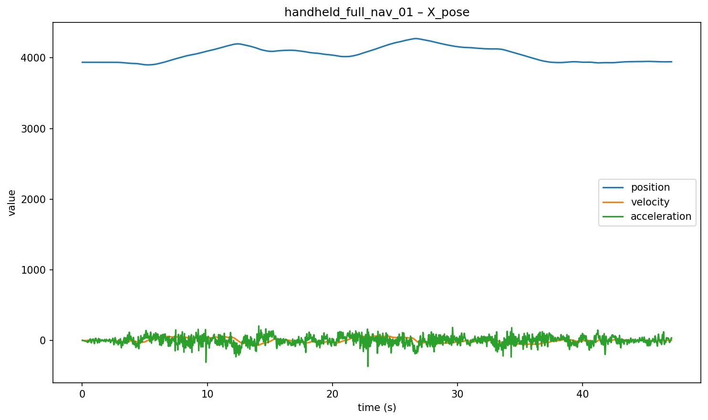 | 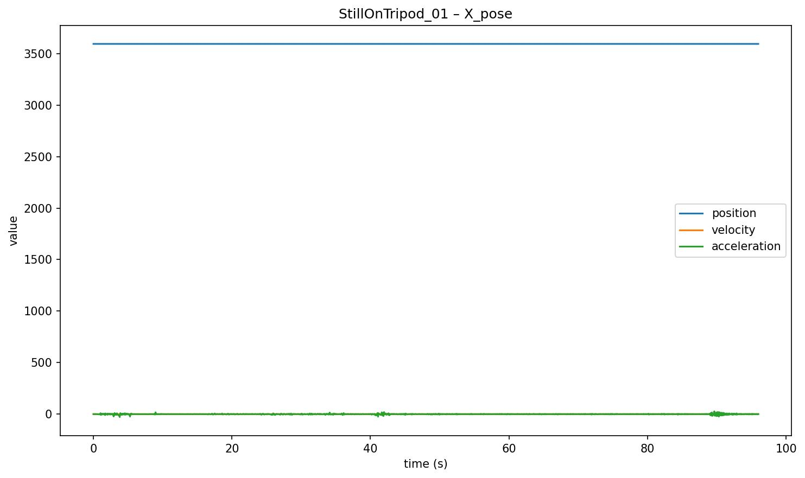 |

**What these graphs show**

- The top line is the **position** along X; the lower lines show **velocity** and **acceleration** for the same axis.
- In a **handheld full navigation** take, position drifts slowly while velocity and acceleration show noticeable variation – the camera is moving through space.
- In a **StillOnTripod** take, position is essentially flat and both velocity and acceleration stay near zero, with only small residual noise.

This visualises how derivatives emphasise motion behaviour, not absolute position.

---

### 4.2 Kinematics per scenario

_(Position / velocity / acceleration, all takes overlaid for one scenario)_

**Command**

```bash
docker compose run --rm linear \
  python kinematics.py \
    --input data/processed/tracking_logs.csv \
    --output data/derived/tracking_derivatives.csv \
    --plot-scenario handheld_still \
    --plot-axis X_pose
```

Output example:

- `data/plots/kinematics_scenarios/handheld_still_X_pose.jpg`
- `data/plots/kinematics_scenarios/StillOnTripod_X_pose.jpg` (from `--plot-scenario StillOnTripod`)

| handheld_still – X_pose (all takes)                                                 | StillOnTripod – X_pose (all takes)                                                |
| ----------------------------------------------------------------------------------- | --------------------------------------------------------------------------------- |
| 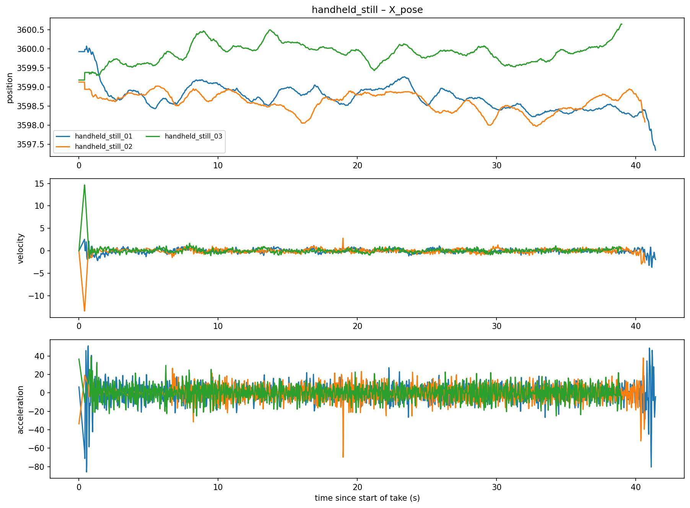 | 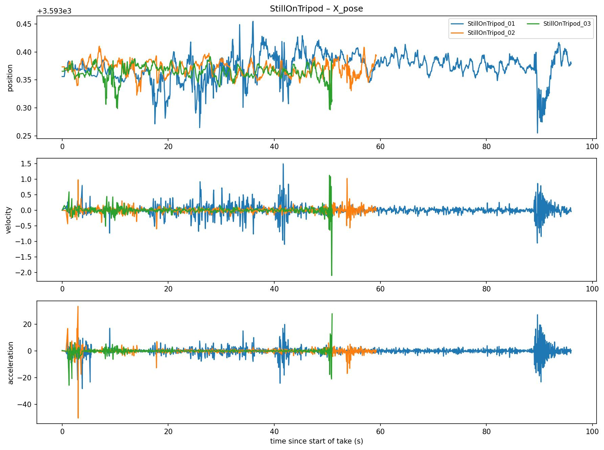 |

**What these graphs show**

- Each colour is one **take** within the same scenario.
- The top subplot shows that handheld-still shots have small but visible drift compared to tripod shots.
- Velocity and acceleration subplots reveal that handheld-still motion has more variation than tripod, but remains bounded compared to fast or travel moves.

This gives an overview of intra-scenario consistency and confirms that the data captures the intended motion classes.

---

### 4.3 Sigma and InterpSpeed per scenario

_(Rolling σ and corresponding adaptive interpolation speed)_

**Command**

```bash
docker compose run --rm linear \
  python linear_sigma_model.py \
    --input data/derived/tracking_derivatives.csv \
    --output data/modeled/tracking_modelled_sigma.csv \
    --config-output data/config/linear_sigma_ranges.json \
    --plot-scenario controlled_handheld_pan \
    --plot-axis Y_rot
```

Output example:

- `data/plots/linear_model_scenarios/controlled_handheld_pan_Y_rot.jpg`
- `data/plots/linear_model_scenarios/fast_pan_tripod_Y_rot.jpg` (from `--plot-scenario fast_pan_tripod`)

| controlled_handheld_pan – Y_rot                                                                       | fast_pan_tripod – Y_rot                                                               |
| ----------------------------------------------------------------------------------------------------- | ------------------------------------------------------------------------------------- |
| 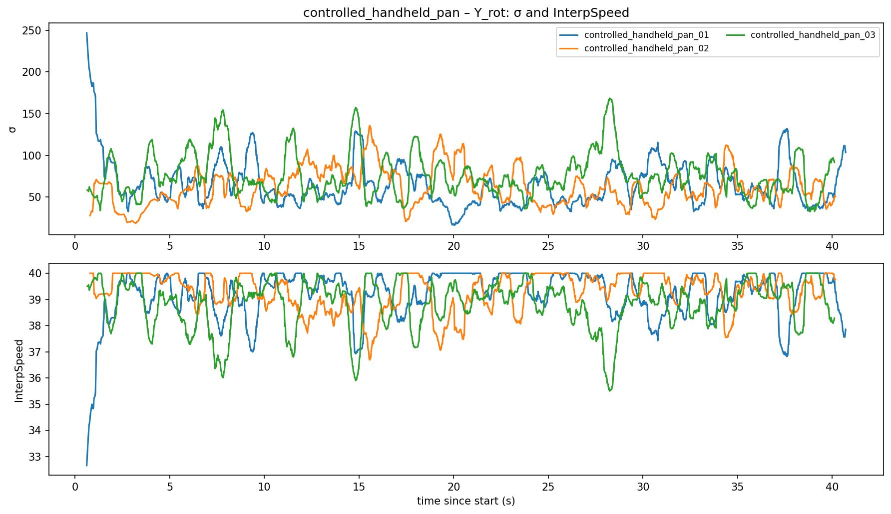 | 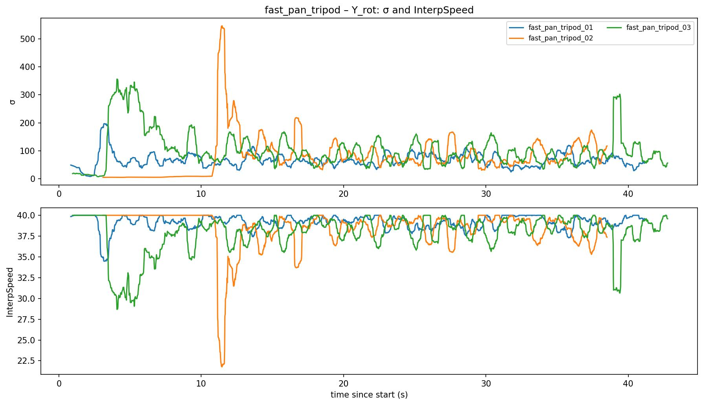 |

**What these graphs show**

- The top subplot is the rolling **σ of angular acceleration** on Y (instability measure).
- The bottom subplot is the resulting **InterpSpeed** chosen by the model at each time.
- For **controlled handheld pan**, σ stays moderate and InterpSpeed remains near the maximum, meaning the filter mostly follows the operator.
- For **fast tripod pans**, σ spikes higher and InterpSpeed is periodically reduced, indicating stronger smoothing during high-instability segments.

This demonstrates the adaptive mapping from local motion statistics to damping strength.

---

### 4.4 Sigma bar plots per axis

_(90th percentile σ per scenario, one axis)_

**Command**

```bash
docker compose run --rm linear \
  python linear_sigma_model.py \
    --input data/derived/tracking_derivatives.csv \
    --output data/modeled/tracking_modelled_sigma.csv \
    --config-output data/config/linear_sigma_ranges.json \
    --plot-bar-axis Z_pose
```

Output example:

- `data/plots/linear_model_sigma_bars/sigma_bar_Z_pose.jpg`
- `data/plots/linear_model_sigma_bars/sigma_bar_Z_rot.jpg` (from `--plot-bar-axis Z_rot`)

| σ (90th percentile) – Z_pose                                                 | σ (90th percentile) – Z_rot                                                |
| ---------------------------------------------------------------------------- | -------------------------------------------------------------------------- |
|  |  |

**What these graphs show**

- Each bar represents the **90th percentile of σ** for one scenario on a given axis.
- Bars are ordered by motion type (tripod, handheld, travel, fast, etc.).
- On Z_pose, only a subset of scenarios produces high σ, reflecting when there is significant depth or vertical movement.
- On Z_rot, aggressive rotational moves show very large σ, clearly separated from static scenarios.

These bar plots justify the choice of `min_sigma` and `max_sigma` per axis and illustrate how σ scales with motion complexity.

---

### 4.5 Smoothing simulation (raw vs smoothed motion, jitter, lag)

**Command**

```bash
docker compose run --rm linear \
  python linear_smoothing_sim.py \
    --logs data/processed/tracking_logs.csv \
    --derived data/derived/tracking_derivatives.csv \
    --config data/config/linear_sigma_ranges.json \
    --axis Y_rot \
    --label fast_pan_tripod_02
```

Output example:

- `data/plots/smoothing/fast_pan_tripod_02_Y_rot.jpg`
- `data/plots/smoothing/fast_tilt_tripod_02_Y_rot.jpg` (from `--label fast_tilt_tripod_02`)

| fast_pan_tripod_02 – Y_rot                                                     | fast_tilt_tripod_02 – Y_rot                                                      |
| ------------------------------------------------------------------------------ | -------------------------------------------------------------------------------- |
| 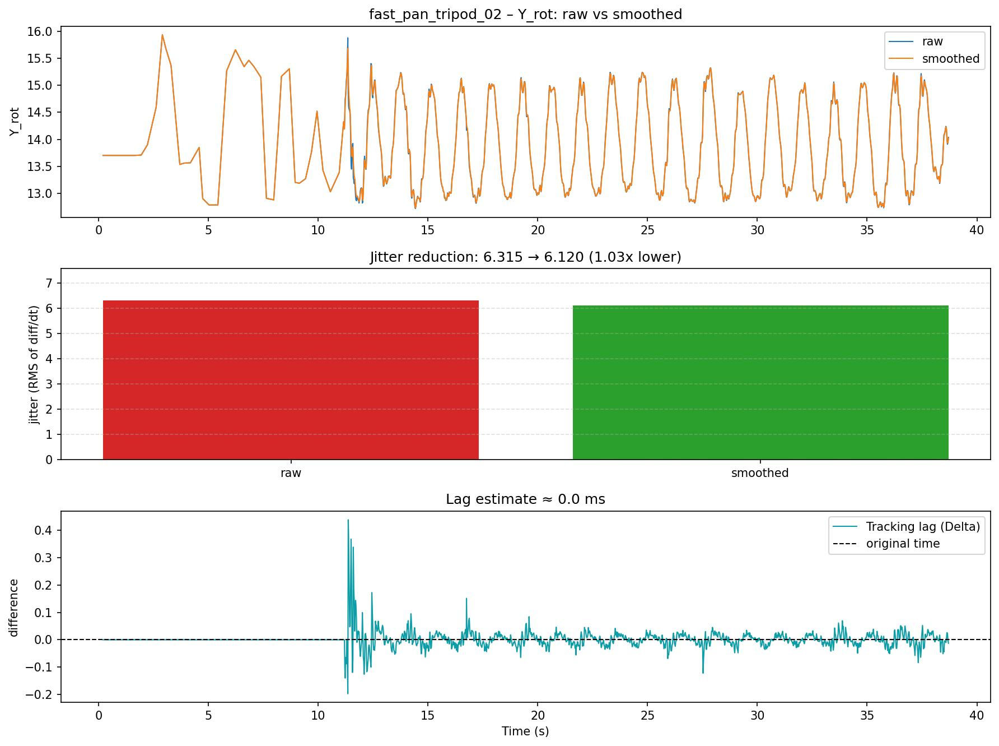 |  |

**What these graphs show**

Each figure has three parts:

1. **Raw vs smoothed motion over time**

   - The orange smoothed curve follows the blue raw curve but removes high-frequency oscillations.

2. **Jitter metric before and after**

   - Bars show the RMS of frame-to-frame differences.
   - A lower value after smoothing indicates reduced jitter; in fast tilt, jitter drops significantly.

3. **Difference and lag estimate**

   - The bottom plot shows `smoothed - raw` over time, with an estimated lag in ms.
   - Fast tilt exhibits more jitter reduction and a small lag (~100 ms); fast pan shows less change and almost zero lag.

These simulations validate that the algorithm behaves as intended: it damps noisy, aggressive motion more strongly while preserving responsiveness where motion is already smooth.

---

### 4.6 Sigma and InterpSpeed per scenario (piecewise model)

**Command**

```bash
docker compose run --rm piecewise \
  python piecewise_sigma_model.py \
    --input data/derived/tracking_derivatives.csv \
    --output data/modeled/tracking_modelled_sigma.csv \
    --config-output data/config/piecewise_sigma_ranges.json \
    --plot-scenario fast_pan_tripod \
    --plot-axis Y_rot
```

Output example:

- `data/piecewise_plots/piecewise_model_scenarios/controlled_handheld_pan_Y_rot_piecewise.jpg`
- `data/piecewise_plots/piecewise_model_scenarios/fast_pan_tripod_Y_rot_piecewise.jpg`

| controlled_handheld_pan – Y_rot                                                                                              | fast_pan_tripod – Y_rot                                                                                      |
| ---------------------------------------------------------------------------------------------------------------------------- | ------------------------------------------------------------------------------------------------------------ |
| 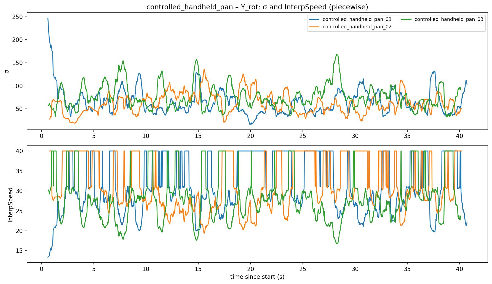 | 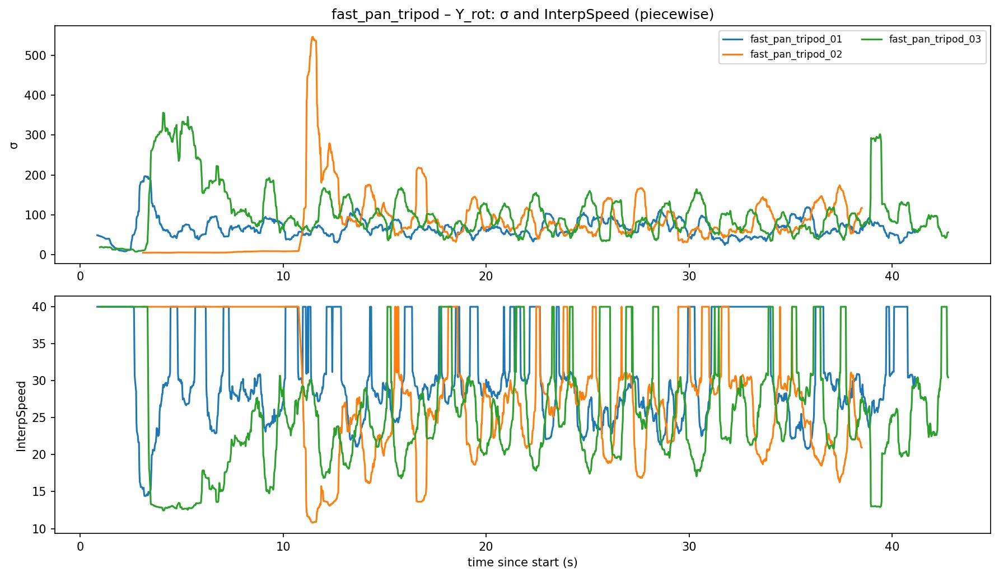 |

**What these graphs show**

- The top subplot is the rolling **σ of angular acceleration** on Y (instability measure).
- The bottom subplot is the resulting **InterpSpeed** chosen by the piecewise model at each time.
- For **controlled handheld pan**, σ stays moderate and InterpSpeed remains near the maximum, meaning the filter mostly follows the operator.
- For **fast tripod pans**, σ spikes higher and InterpSpeed is periodically reduced, indicating stronger smoothing during high-instability segments.
  This demonstrates the adaptive mapping from local motion statistics to damping strength using a piecewise function.

---

### 4.7 Sigma bar plots per axis (piecewise model)

**Command**

```bash
docker compose run --rm piecewise \
  python piecewise_sigma_model.py \
    --input data/derived/tracking_derivatives.csv \
    --output data/modeled/tracking_modelled_sigma_piecewise.csv \
    --config-output data/config/piecewise_sigma_ranges.json \
    --plot-bar-axis Z_pose
```

Output example:

- `data/piecewise_plots/piecewise_model_sigma_bars/sigma_bar_Z_pose_piecewise.jpg`
- `data/piecewise_plots/piecewise_model_sigma_bars/sigma_bar_Z_rot_piecewise.jpg`

| σ (90th percentile) – Z_pose                                                                        | σ (90th percentile) – Z_rot                                                                       |
| --------------------------------------------------------------------------------------------------- | ------------------------------------------------------------------------------------------------- |
|  |  |

**What these graphs show**

- Each bar represents the **90th percentile of σ** for one scenario on a given axis.
- Bars are ordered by motion type (tripod, handheld, travel, fast, etc.).
- On Z_pose, only a subset of scenarios produces high σ, reflecting when there is significant depth or vertical movement.
- On Z_rot, aggressive rotational moves show very large σ, clearly separated from static scenarios.
  These bar plots justify the choice of σ-breaks and speed levels per axis and illustrate how σ scales with motion complexity.

---

### 4.8 Smoothing simulation (piecewise model) (raw vs smoothed motion, jitter, lag)

**Command**

```bash
docker compose run --rm piecewise\
   python piecewise_smoothing_sim.py\
        --logs data/processed/tracking_logs.csv\
        --derivatives data/derived/tracking_derivatives.csv\
        --config data/config/piecewise_sigma_ranges.json\
        --axis Y_rot\
        --label fast_pan_tripod_02
```

Output example:

- `data/piecewise_plots/smoothing/fast_pan_tripod_02_Y_rot_piecewise.jpg`
- `data/piecewise_plots/smoothing/controlled_handheld_pan_03_Y_rot_piecewise.jpg`

| fast_pan_tripod_02 – Y_rot                                                                         | controlled_handheld_pan_03 – Y_rot                                                                                 |
| -------------------------------------------------------------------------------------------------- | ------------------------------------------------------------------------------------------------------------------ |
|  | 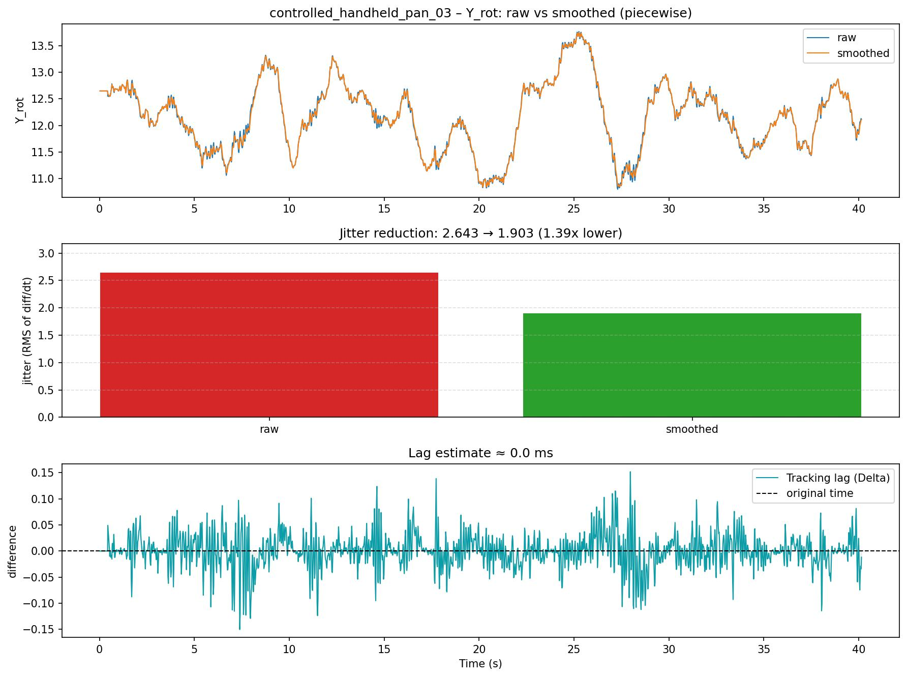 |

**What these graphs show**
Each figure has three parts:

1. **Raw vs smoothed motion over time**
   - The orange smoothed curve follows the blue raw curve but removes high-frequency oscillations.
2. **Jitter metric before and after**
   - Bars show the RMS of frame-to-frame differences.
   - A lower value after smoothing indicates reduced jitter; in fast tilt, jitter drops significantly.
3. **Difference and lag estimate**
   - The bottom plot shows `smoothed - raw` over time, with an estimated lag in ms.
   - Fast tilt exhibits more jitter reduction and a small lag (~100 ms); fast pan shows less change and almost zero lag.
     These simulations validate that the piecewise algorithm behaves as intended: it damps noisy, aggressive motion more strongly while preserving responsiveness where motion is already smooth.

---

### 4.9 Sigma and InterpSpeed per scenario (sigmoid model)

**Command**

```bash
docker compose run --rm sigmoid \
  python sigmoid_sigma_model.py \
    --input data/derived/tracking_derivatives.csv \
    --output data/modeled/tracking_modelled_sigma_sigmoid.csv \
    --config-output data/config/sigmoid_sigma_ranges.json \
    --plot-scenario fast_pan_tripod \
    --plot-axis Y_rot
```

Output example:

- `data/sigmoid_plots/sigmoid_model_scenarios/controlled_handheld_pan_Y_rot.jpg`
- `data/sigmoid_plots/sigmoid_model_scenarios/fast_pan_tripod_Y_rot.jpg`

| controlled_handheld_pan – Y_rot                                                                                | fast_pan_tripod – Y_rot                                                                        |
| -------------------------------------------------------------------------------------------------------------- | ---------------------------------------------------------------------------------------------- |
| 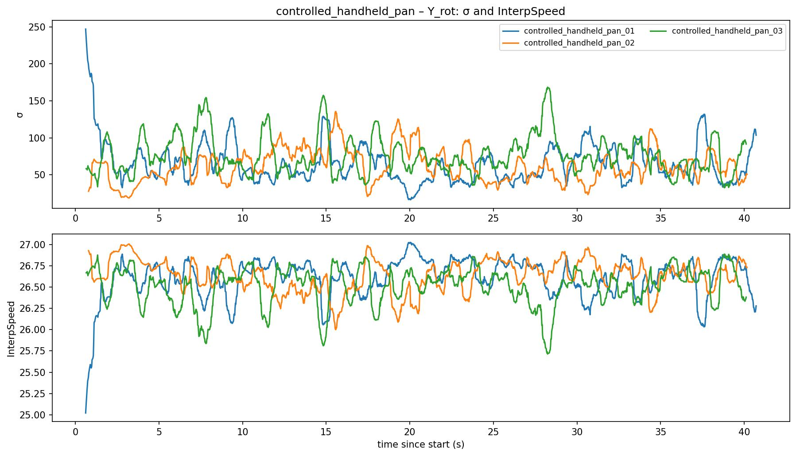 | 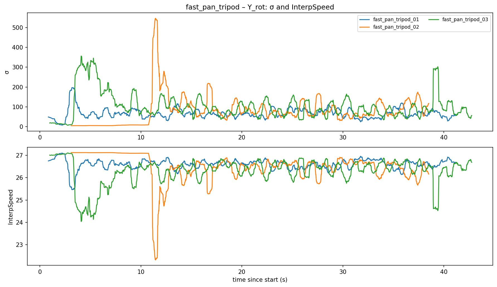 |

**What these graphs show**

- The top subplot is the rolling **σ of angular acceleration** on Y (instability measure).
- The bottom subplot is the resulting **InterpSpeed** chosen by the sigmoid model at each time.
- For **controlled handheld pan**, σ stays moderate and InterpSpeed remains near the maximum, meaning the filter mostly follows the operator.
- For **fast tripod pans**, σ spikes higher and InterpSpeed is periodically reduced, indicating stronger smoothing during high-instability segments.
  This demonstrates the adaptive mapping from local motion statistics to damping strength using a sigmoid function.

---

### 4.10 Sigma bar plots per axis (sigmoid model)

**Command**

```bash
docker compose run --rm sigmoid \
  python sigmoid_sigma_model.py \
    --input data/derived/tracking_derivatives.csv \
    --output data/modeled/tracking_modelled_sigma_sigmoid.csv \
    --config-output data/config/sigmoid_sigma_ranges.json \
    --plot-bar-axis Z_pose
```

Output example:

- `data/sigmoid_plots/sigmoid_model_sigma_bars/sigma_bar_Z_pose.jpg`
- `data/sigmoid_plots/sigmoid_model_sigma_bars/sigma_bar_Z_rot.jpg`

| σ (90th percentile) – Z_pose                                                          | σ (90th percentile) – Z_rot                                                         |
| ------------------------------------------------------------------------------------- | ----------------------------------------------------------------------------------- |
| 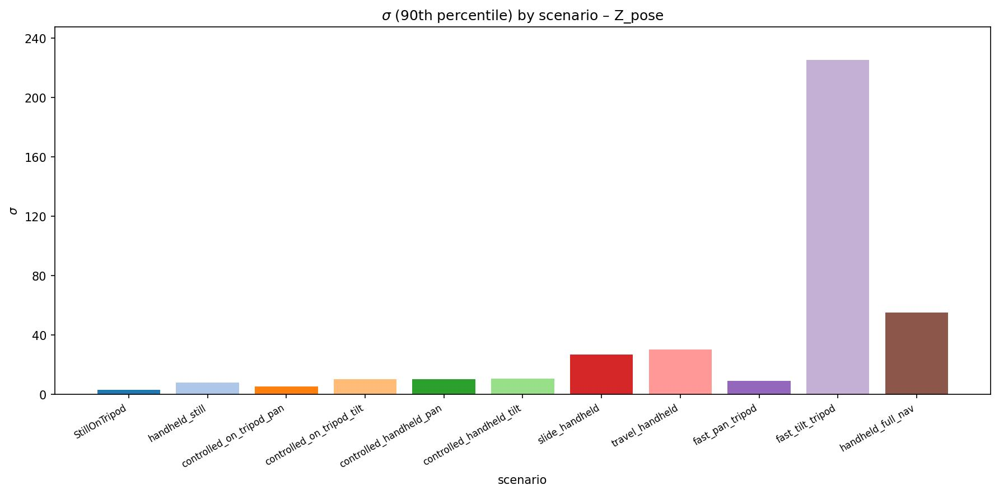 | 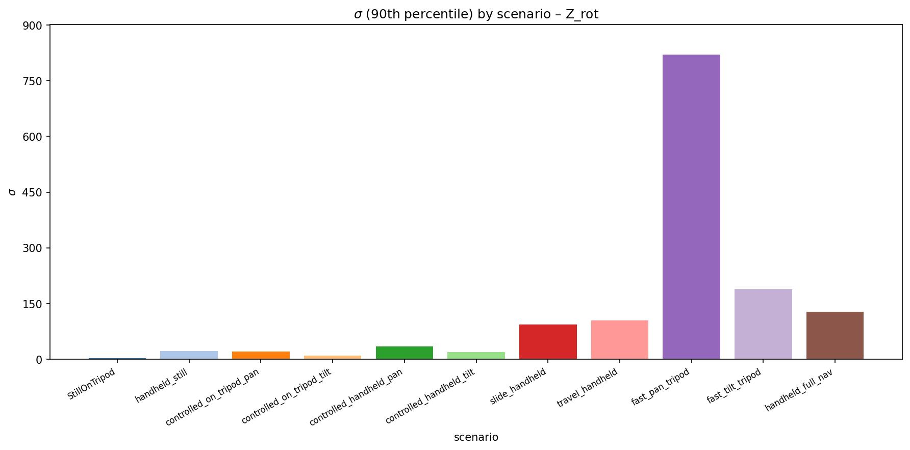 |

**What these graphs show**

- Each bar represents the **90th percentile of σ** for one scenario on a given axis.
- Bars are ordered by motion type (tripod, handheld, travel, fast, etc.).
- On Z_pose, only a subset of scenarios produces high σ, reflecting when there is significant depth or vertical movement.
- On Z_rot, aggressive rotational moves show very large σ, clearly separated from static scenarios.
  These bar plots justify the choice of sigmoid inflection points and speed bounds per axis and illustrate how σ scales with motion complexity.

---

### 4.11 Smoothing simulation (sigmoid model) (raw vs smoothed motion, jitter, lag)

**Command**

```bash
docker compose run --rm sigmoid\
   python sigmoid_smoothing_sim.py\
        --logs data/processed/tracking_logs.csv\
        --derived data/derived/tracking_derivatives.csv\
        --config data/config/sigmoid_sigma_ranges.json\
        --axis Y_rot\
        --label fast_pan_tripod_02
```

Output example:

- `data/sigmoid_plots/smoothing/fast_pan_tripod_02_Y_rot_sigmoid.jpg`
- `data/sigmoid_plots/smoothing/controlled_handheld_pan_03_Y_rot_sigmoid.jpg`

| fast_pan_tripod_02 – Y_rot                                                                     | controlled_handheld_pan_03 – Y_rot                                                                             |
| ---------------------------------------------------------------------------------------------- | -------------------------------------------------------------------------------------------------------------- |
| 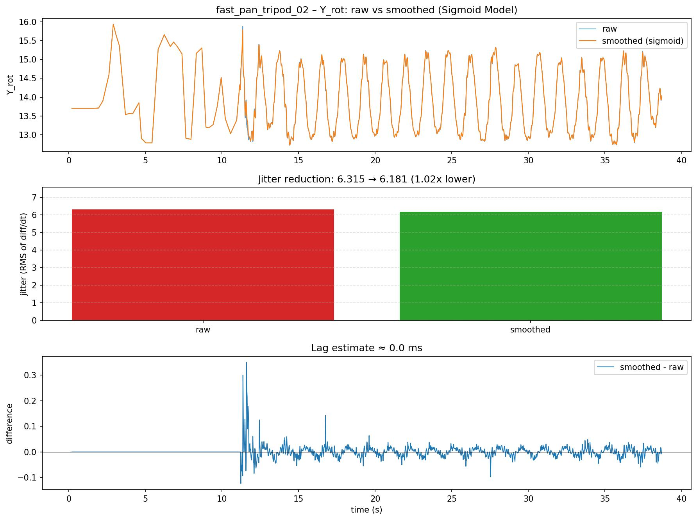 | 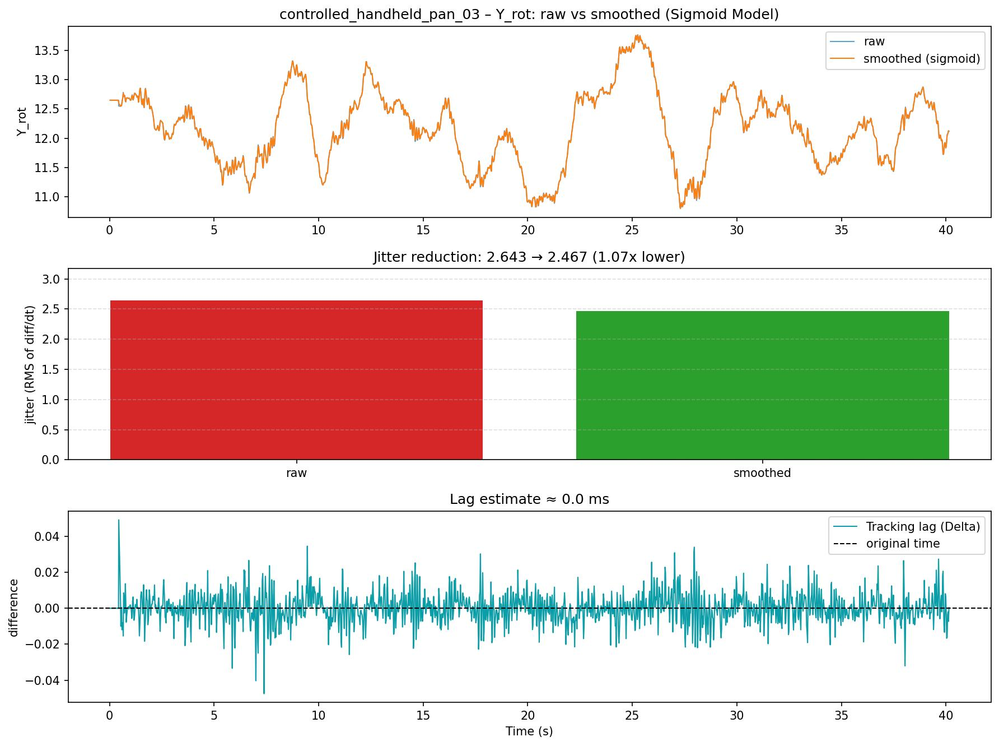 |

**What these graphs show**

- Each figure has three parts:

1. **Raw vs smoothed motion over time**
   - The orange smoothed curve follows the blue raw curve but removes high-frequency oscillations.
2. **Jitter metric before and after**
   - Bars show the RMS of frame-to-frame differences.
   - A lower value after smoothing indicates reduced jitter; in fast tilt, jitter drops significantly.
3. **Difference and lag estimate**
   - The bottom plot shows `smoothed - raw` over time, with an estimated lag in ms.
   - Fast tilt exhibits more jitter reduction and a small lag (~ 0.0 ms); fast pan shows less change as this level of speed is classified as intentional.
   - These simulations validate that the sigmoid algorithm behaves as intended: it damps noisy, aggressive motion more strongly while preserving responsiveness where motion is already smooth.

---

## **This process can be replicated for any other models implemented in the repo, for all axes and labels present in the dataset.**

### 4.12 Linear Sommthing VS Piecewise Smoothing VS Sigmoid Smoothing Comparison

| Linear Model – controlled_handheld_pan – Y_rot                                              | Piecewise Model – controlled_handheld_pan – Y_rot                                                               | Sigmoid Model – controlled_handheld_pan – Y_rot                                                             |
| ------------------------------------------------------------------------------------------- | --------------------------------------------------------------------------------------------------------------- | ----------------------------------------------------------------------------------------------------------- |
| 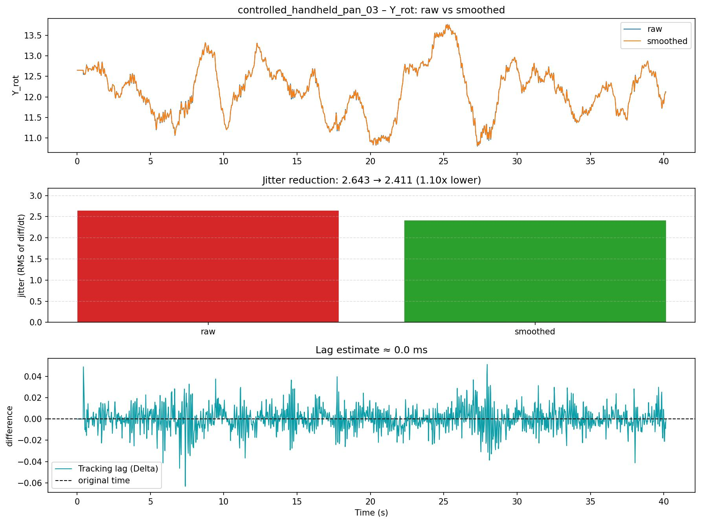 |  |  |

**What these graphs show**

- ### Linear Model:

  - The linear mapping is conservative. It reduces jitter a bit, but it is clearly prioritising responsiveness by remaining very close to the raw signal.
  - The model is a good "safe default". It does not affect the signal much. It applies small corrections when the motion is very jittery. Otherwise, it remains very close to the raw signal.
  - This makes the model very useful in certain use cases, where simple jitter reduction is desired, while responsiveness is of highest priority.

- ### Piecewise Model:

  - The piecewise mapping is more aggressive generally -as shown in this sequence- It removes more high-frequency energy while still keeping the signal aligned in time.
  - The model is a "strong stabilizer". It applies larger level of smoothness, and is more sensitive to jitter variations, thanks to the multiple breakpoints.
  - Even with more smoothing, the lag produced by the model is essentially the same as the linear model. This proves the piecewise model ability to generalize over most use cases without introducing additional latency.

- ### Sigmoid Model:

  - The sigmoid mapping is somewhere in between the linear and piecewise models. It is the none liener model among the three.
  - It sits -both conceptually and in practice- between the linear and piecewise models.
  - like the linear model, it balances the signal across two ends of the range, but unlike the linear model, the steps between those two ends is non-linear, following a sigmoid curve.
  - Unlike the piecewise model, it does not have multiple breakpoints, but rather a smooth transition between the two ends of the range, due to its nonlinear nature.
  - The model is a "balanced stabilizer". It applies moderate levels of smoothness, and steps gradually between jitter variations, thanks to the sigmoid curve.
  - The lag produced by the model is also essentially the same as the linear and piecewise models in most cases. This proves the sigmoid model ability to generalize over most use cases without introducing additional latency.

- ### Comparitive Analysis:

  - Depending on the use case, one model may be preferred over the other. The linear model is a good baseline.

  - Other models, with more sigma breakpoints/variation (e.g. the piecewise model) can offer further control over tuning options, but with potential slight latency trade-offs in certain scenarios.

  - The difference between the linear and the piecewise models will be most visible in the mid range motion scenarios, as the multiple breakpoints implemented in the piecewise model allows it to be more sensitive to the different nuances of jitter levels in those mid-range scenarios.

  - Conversely, both models will behave similarly on extreme scenarios (very static or very fast motion).

  - The sigmoid model offers a middle ground between the two, with a smooth transition that can be beneficial in scenarios where a gradual transition between jitter reduction and responsiveness is desired.
    In this current three-model setup,
  - The linear model can be seen as the Safe/Basic Control (Basic Mode),
  - The piecewise model as the manual/specific Control (Expert Mode),
  - And the sigmoid model as the Organic/Automated Control (Smart Mode).

  Ultimately, the choice of model will depend on the specific requirements of the application, such as the desired level of smoothness, responsiveness, and the nature of the motion being captured.

---

## 5. Modularity and scalability

This project is structured so that individual components can be replaced or extended without breaking the rest:

- **Data acquisition**
  Any system that outputs `tracking_logs.csv` with the same schema can plug into the pipeline: different trackers, different scenes, or even synthetic motion.

- **Kinematics and features**
  `kinematics.py` centralises time-based derivatives. Additional features (e.g. jerk, windowed energy, frequency-domain metrics) can be added here without touching the model code.

- **Models**

  - `linear_sigma_model.py` implements a single, interpretable baseline.
    `<any_additional_model(s)>_sigma_model.py` file(s) implement alternative mappings strategies based on their sigma breakpoints and speed ranges.
  - Each model reads from `tracking_derivatives.csv` and writes to its own modelled CSV `<model>_sigma_model.csv`, and its own configuration JSON `<model>_sigma_model.json`.

- **Runtime implementation**
  - The logic demonstrated in `<any_model>_smoothing_sim.py` maps directly to an Unreal Engine implementation.
  - The flexibility offered by the system to create different models allow for different runtime implementations within Unreal Engine to be tested and compared easily.
  - All different runtime implementations will apply their own smoothing logic, while adhering to the same overall principles:
    - Maintain a per-axis acceleration buffer.
    - Compute rolling σ with a fixed window size.
    - Map σ to InterpSpeed using pre-computed bounds.
    - Apply FInterpTo each frame.

---

## 6. Summary

To reproduce the core results:

1. Provide or generate a `data/processed/tracking_logs.csv` with the schema described in §2.

2. Run the pipeline inside Docker:

   ```bash
   docker compose build
   docker compose run --rm linear   # or any other model/service
   ```

3. Generate any of the example plots using the CLI commands as shown in §4.

The combination of the structured datasets, modular scripts, and Docker-based execution aims to make the system transparent, reproducible, and easy to extend for further scalability when testing with adding new models or datasets.
