# Adaptive Smoothing for Portable Camera Tracking – Analysis and Modelling Pipeline

This repository contains the analysis and modelling pipeline for an adaptive camera-motion smoothing system.  
The system learns axis-wise motion statistics from recorded tracking data and uses them to drive smoothing models that can later be implemented in Unreal Engine or as a C++ plugin.

The repo is designed to be:

- **Reproducible** – all steps run inside Docker.
- **Modular** – parsing, kinematics, modelling, and simulation are separate scripts.
- **Extensible** – new models can be added without changing the data pipeline.

---

## 1. Repository structure

At the top level you should see something close to:

```text

├── Dockerfile
├── docker-compose.yml
├── parser.py                      # Parses the raw .log files into csv
├── kinematics.py
├── linear_sigma_model.py          # rolling σ + linear inverse mapping per axis
├── linear_smoothing_sim.py        # offline simulation using linear model
├── piecewise_sigma_model.py       # rolling σ + piecewise inverse mapping per axis
├── piecewise_smoothing_sim.py     # offline simulation using piecewise model
├── sigmoid_sigma_model.py         # rolling σ + sigmoid inverse mapping per axis
├── sigmoid_smoothing_sim.py       # offline simulation using sigmoid model
├── one_euro_filter_model.py       # velocity distribution analysis + One Euro filter config
├── one_euro_smoothing_sim.py      # offline simulation using the One Euro filter
├── README.md
├── parse_validation.py            # Parses the validation raw .log files into csv
├── validator.py                   # validates the smoothing results from UE runtime
├── scripts/                       # Bash scripts to run different models as separate services
└── data/                          # (not versioned)
    ├── raw/                       # Unreal log files or text exports
    ├── processed/                 # tracking_logs.csv
    ├── derived/                   # tracking_derivatives.csv
    ├── modeled/                   # contains modelled CSVs per model
    │   └── tracking_modelled_sigma.csv
    │   └── tracking_modelled_sigma_piecewise.csv
    │   └── tracking_modelled_sigma_sigmoid.csv
    │   └── one_euro_modeled.csv
    ├── config/       # configuration JSONs per model
    │   └── linear_sigma_ranges.json    # σ ranges + speed bounds per axis (linear)
    │   └── piecewise_sigma_ranges.json # σ breaks + speed levels per axis (piecewise)
    │   └── sigmoid_sigma_ranges.json   # σ ranges + speed bounds per axis (sigmoid)
    │   └── one_euro_params.json        # fc_min, beta, d_cutoff + velocity stats per axis
    └── plots/
    │   ├── kinematics/
    │   ├── kinematics_scenarios/
    │   ├── linear_model_scenarios/
    │   ├── linear_model_sigma_bars/
    │   └── smoothing/
    │── piecewise_plots/
    │   ├── piecewise_model_scenarios/
    │   ├── piecewise_model_sigma_bars/
    │   └── smoothing/
    └── sigmoid_plots/
    │   ├── sigmoid_model_scenarios/
    │   ├── sigmoid_model_sigma_bars/
    │   └── smoothing/
    └── one_euro_plots/
    │   ├── analysis/
    │   └── smoothing/
    ├── validation/
    │   ├── raw/           # raw .log files from UE runtime
    │   ├── processed/     # parsed csv files from the test raw logs
    │   └── plots/         # validation plots
```

### 1.1 Code files

#### Architecture files:

- **`Dockerfile`**
  Defines a minimal Python image with the dependencies needed to run the pipeline.

- **`docker-compose.yml`**
  Wraps the image into named services, mounts the `data/` folder from the host into the container, and sets the working directory and default command for each service.

#### Data processing and feature engineering files:

- **`parser.py`**
  Parses raw Unreal Engine log or text files from `data/raw/`, extracts the lines produced by the logging blueprint, and writes a clean table to `data/processed/tracking_logs.csv`.

- **`kinematics.py`**
  Reads `tracking_logs.csv`, computes:
  - `dt` (frame-to-frame time difference),
  - velocity per axis (`V_X_pose`, …, `V_Z_rot`),
  - acceleration per axis (`A_X_pose`, …, `A_Z_rot`),
    using a causal backward-difference scheme, and writes them to `data/derived/tracking_derivatives.csv`.
    It also provides plotting utilities for position / velocity / acceleration.

#### Models and simulation files:

- **_Linear_**:
  - **`linear_sigma_model.py`**
    Implements the sigma-based model:
    - computes rolling standard deviation of acceleration (`sigma_*`),
    - calibrates per-axis `min_sigma` / `max_sigma` from labelled scenarios,
    - maps `sigma` → `InterpSpeed_*` with a linear inverse mapping,
    - writes the extended table to `data/modeled/tracking_modelled_sigma.csv`,
    - writes configuration to `data/config/linear_sigma_ranges.json`,
    - includes plotting utilities for `sigma` and `InterpSpeed`.

  - **`linear_smoothing_sim.py`**
    Replays a single take and axis and applies the same logic that will be used in Unreal:
    - recomputes rolling `sigma` online,
    - looks up model parameters from `linear_sigma_ranges.json`,
    - applies an FInterpTo-style smoothing step frame by frame,
    - generates plots showing raw vs smoothed motion, jitter reduction, and lag.

- **_Piecewise_**:
  - **`piecewise_sigma_model.py`**
    - computes rolling σ per axis and calibrates
      piecewise σ-breaks from the scenario groups _static / slow tripod / controlled handheld / medium / fast_.
    - writes the extended table to `data/modeled/tracking_modelled_sigma_piecewise.csv`,
    - writes configuration to `data/config/piecewise_sigma_ranges.json`.

  - **`piecewise_smoothing_sim.py`** – replays a single take using the
    piecewise mapping, then plots raw vs smoothed motion, jitter reduction and lag.
    Plots go to `data/piecewise_plots/smoothing/`.

- **_Sigmoid_**:
  - **`sigmoid_sigma_model.py`**
    - computes rolling σ per axis and calibrates
      sigmoid inflection points from the scenario groups _static / slow tripod / controlled handheld / medium / fast_.
    - writes the extended table to `data/modeled/tracking_modelled_sigma_sigmoid.csv`,
    - writes configuration to `data/config/sigmoid_sigma_ranges.json`.

  - **`sigmoid_smoothing_sim.py`** – replays a single take using the
    sigmoid mapping, then plots raw vs smoothed motion, jitter reduction and lag.
    Plots go to `data/sigmoid_plots/smoothing/`.

- **_One Euro_**:
  - **`one_euro_filter_model.py`**
    Implements the One Euro velocity-adaptive filter:
    - analyses per-axis velocity distributions across scenario groups from `tracking_derivatives.csv`,
    - runs the filter forward across the full dataset with the configured parameters,
    - computes per-axis jitter and lag metrics to validate parameter choices,
    - writes the filtered output to `data/modeled/one_euro_modeled.csv`,
    - writes configuration to `data/config/one_euro_params.json`,

  - **`one_euro_smoothing_sim.py`** – replays a single take and axis using the One Euro
    filter frame by frame, applying per-axis parameters from `one_euro_params.json`.
    Handles Euler-angle unwrapping on rotation axes before filtering and wraps output back
    to (−180, 180] degrees. Plots go to `data/one_euro_plots/smoothing/`.

#### Validation files:

- **`parse_validation.py`**
  - Parses raw Unreal log or text files from `data/validation/raw/`,
  - extracts the lines produced by the logging blueprint,
  - writes clean tables to `data/validation/processed/`.
  - writes a 6DOF version of the processed csv to `data/validation/simualte/`.
    The generated file would be used to compute kinematics.
  - writes derived kinematics from the processed csv to `data/validation/simualte/`. The generated file would be used in the simulation pipeline.

- **`validation.py`**
  - compares the raw and smoothed trajectories,
  - computes the key metrics; RMS error, lag, jitter, and smoothness,
  - generates validation plots in `data/validation/plots/`.

---

## 2. Data Pipeline - Datasets Generation

### 2.1 Starting dataset: `tracking_logs.csv`

The main entry point for the analysis is:

`data/processed/tracking_logs.csv`

This file is **not** in version control. to replicate the setup, you can either:

- Generate it from your own Unreal logs by placing `.log` / `.txt` files in `data/raw/` and running `parser.py`, or
- Create your own `tracking_logs.csv` with the same schema.

The expected columns are:

```text
time        # float, game time in seconds since start of take
label       # string, e.g. 'still_on_tripod_01'
scenario    # string, e.g. 'still_on_tripod', 'fast_pan_tripod'
take        # int, take number within the scenario
X_pose      # float, position X
Y_pose      # float, position Y
Z_pose      # float, position Z
X_rot       # float, rotation X (roll)
Y_rot       # float, rotation Y (pitch)
Z_rot       # float, rotation Z (yaw)
```

Each **label** is unique per take (e.g. `handheld_full_nav_03`) and contains a contiguous time series of frames.

If you have `tracking_logs.csv` with this shape, you can skip `parser.py` and start from `kinematics.py`.

### 2.2 Derived datasets

Running the full pipeline produces:

- `data/derived/tracking_derivatives.csv`

  Columns:

  ```text
  time, label, scenario, take, dt,
  V_X_pose, V_Y_pose, V_Z_pose, V_X_rot, V_Y_rot, V_Z_rot,
  A_X_pose, A_Y_pose, A_Z_pose, A_X_rot, A_Y_rot, A_Z_rot
  ```

- `data/modeled/tracking_modelled_sigma.csv`

  Extends the above with:

  ```text
  sigma_X_pose, ..., sigma_Z_rot,
  InterpSpeed_X_pose, ..., InterpSpeed_Z_rot
  ```

- `data/config/linear_sigma_ranges.json`

  Per-axis configuration:

  ```json
  {
    "window": 25,
    "axes": {
      "X_pose": {
        "min_sigma": ...,
        "max_sigma": ...,
        "min_speed": ...,
        "max_speed": ...
      },
      ...
    }
  }
  ```

- `data/config/piecewise_sigma_ranges.json`

  Per-axis configuration with piecewise σ-breaks and speed levels.

  ```json
  {
    "window_size": 25,
    "groups": [
      "static",
      "slow_tripod",
      "controlled_handheld",
      "medium",
      "fast"
    ],
    "axes": {
      "X_pose": {
        "sigma_breaks": [..., ..., ..., ..., ...],
        "speed_levels": [..., ..., ..., ..., ...],
        "min_sigma": ...,
        "max_sigma": ...,
        "min_speed": ...,
        "max_speed": ...
      },
      ...
    }
  }
  ```

- `data/config/sigmoid_sigma_ranges.json`
  Per-axis configuration with sigmoid inflection points and speed bounds.

  ```json
  {
    "window_size": 25,
    "axes": {
      "X_pose": {
        "min_sigma": ...,
        "max_sigma": ...,
        "min_speed": ...,
        "max_speed": ...,
        "midpoint": ...,
        "steepness": ...
      },
      ...
    }
  }
  ```

- `data/config/one_euro_params.json`
  Per-axis filter parameters and velocity statistics for the One Euro filter.

  ```json
  {
    "model": "one_euro",
    "axes": {
      "X_pose": {
        "fc_min": ...,
        "beta": ...,
        "d_cutoff": ...,
        "velocity_p90_stable": ...,
        "velocity_p90_fast": ...,
        "jitter_raw": ...,
        "jitter_filtered": ...,
        "jitter_reduction_x": ...,
        "lag_samples": ...
      },
      ...
    }
  }
  ```

---

## 3. Getting it to run on another machine

### 3.1 Requirements

- Docker and Docker Compose installed.
- A clone of this repository.
- A `data/processed/tracking_logs.csv` file in the shape described above.

Optional: raw UE logs in `data/raw/` if you also want to test `parser.py`.

### 3.2 Build pipeline (rebuild all from processed data)

From the repo root:

```bash
# 1) Build the Docker image
docker compose up --build -d

# 2) Run the default pipeline inside the container
docker compose run --rm linear (or sigmoid / piecewise / one_euro / <any_additional_model(s)>)
```

The default command (as set in `docker-compose.yml`) will typically execute a driver script or a sequence like:

```bash
python parser.py
python kinematics.py
python <model_script(s)>.py
```

After this, the output should be:

- `data/derived/tracking_derivatives.csv`
- `data/modeled/tracking_modelled_sigma.csv`
- `data/modeled/tracking_modelled_sigma_<any_additional_model(s)>.csv`
- `data/modeled/one_euro_modeled.csv`
- `data/config/linear_sigma_ranges.json`
- `data/config/<any_additional_model(s)>_sigma_ranges.json`
- `data/config/one_euro_params.json`

If you only want to recompute derivatives or models, you can call each script directly with `docker compose run --rm <service> python ...` as shown below.

---

## 4. Command-line usage and plotting scenarios

The scripts **kinematics.py**, along with **linear_sigma_model.py**, **any_additional_model(s)\_sigma_model.py**, and **one_euro_filter_model.py** all expose a custom CLI.
This section shows some of the typical cases of using and utilizing the CLI to trigger the pipeline of the system, and generate different plots.

---

### 4.1 Kinematics per label

_(Position / velocity / acceleration for one take and axis)_

**Command**

```bash
docker compose run --rm linear \
  python kinematics.py \
    --input data/processed/tracking_logs.csv \
    --output data/derived/tracking_derivatives.csv \
    --plot-label handheld_full_nav_01 \
    --plot-axis X_pose
```

Output example (saved as JPG):

- `data/plots/kinematics/handheld_full_nav_01_X_pose.jpg`
- `data/plots/kinematics/still_on_tripod_01_X_pose.jpg` (from a similar command with `--plot-label still_on_tripod_01`)

| handheld_full_nav_01 – X_pose                                                         | still_on_tripod_01 – X_pose                                                       |
| ------------------------------------------------------------------------------------- | --------------------------------------------------------------------------------- |
| 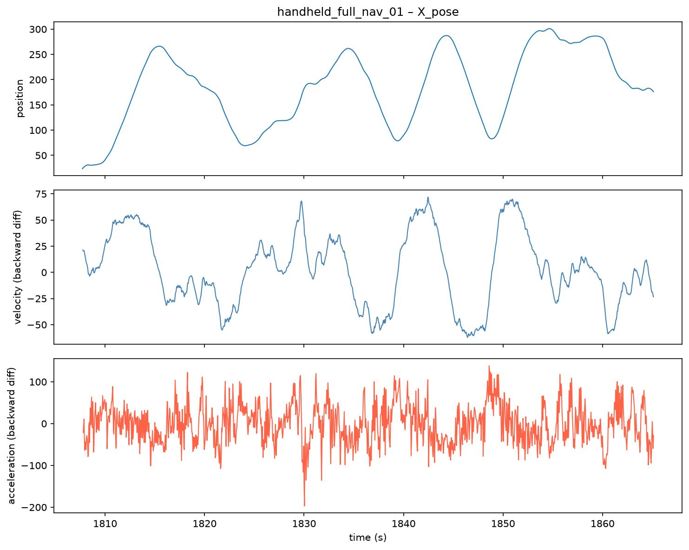 | 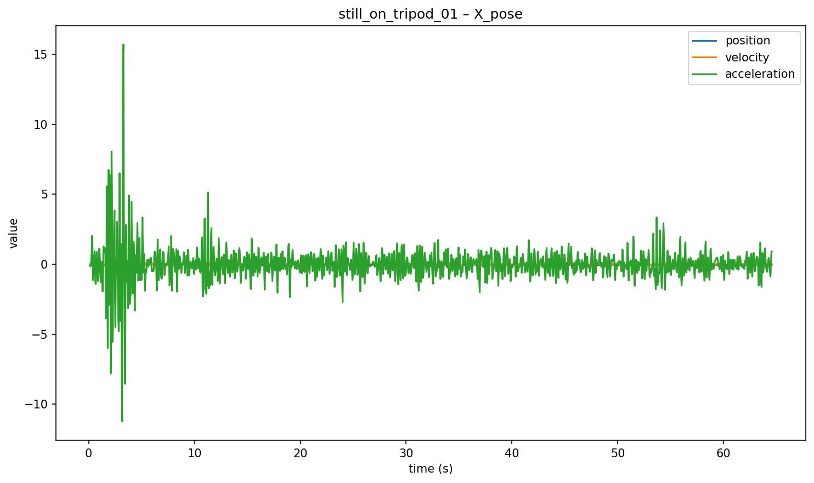 |

**What these plots show**

- The top line is the **position** along X; the lower lines show **velocity** and **acceleration** for the same axis.
- In a **handheld full navigation** take, position drifts slowly while velocity and acceleration show noticeable variation – the camera is moving through space.
- In a **still_on_tripod** take, position is essentially flat and both velocity and acceleration stay near zero, with only small residual noise.

This visualises how derivatives emphasise motion behaviour, not absolute position.

---

### 4.2 Kinematics per scenario

_(Position / velocity / acceleration, all takes overlaid for one scenario)_

**Command**

```bash
docker compose run --rm linear \
  python kinematics.py \
    --input data/processed/tracking_logs.csv \
    --output data/derived/tracking_derivatives.csv \
    --plot-scenario handheld_still \
    --plot-axis X_pose
```

Output example:

- `data/plots/kinematics_scenarios/handheld_still_X_pose.jpg`
- `data/plots/kinematics_scenarios/still_on_tripod_X_pose.jpg` (from `--plot-scenario still_on_tripod`)

| handheld_still – X_pose (all takes)                                                 | still_on_tripod – X_pose (all takes)                                                  |
| ----------------------------------------------------------------------------------- | ------------------------------------------------------------------------------------- |
| 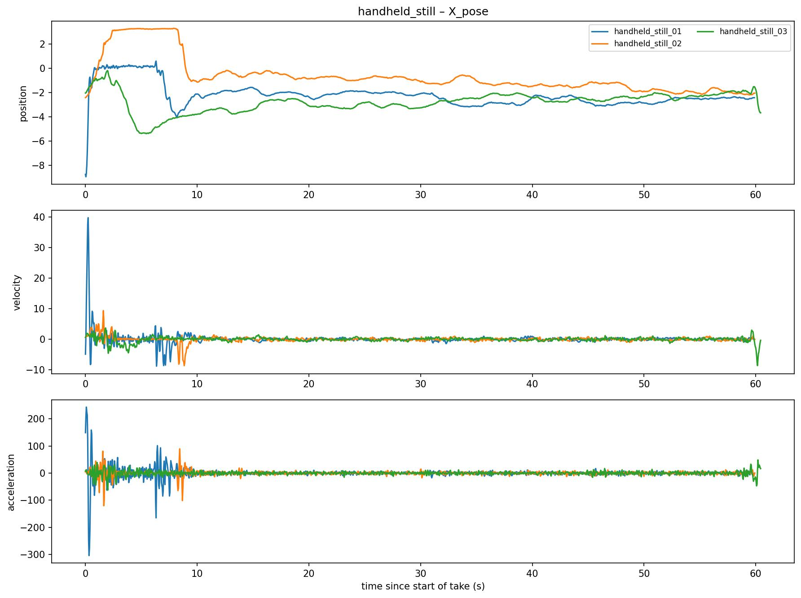 | 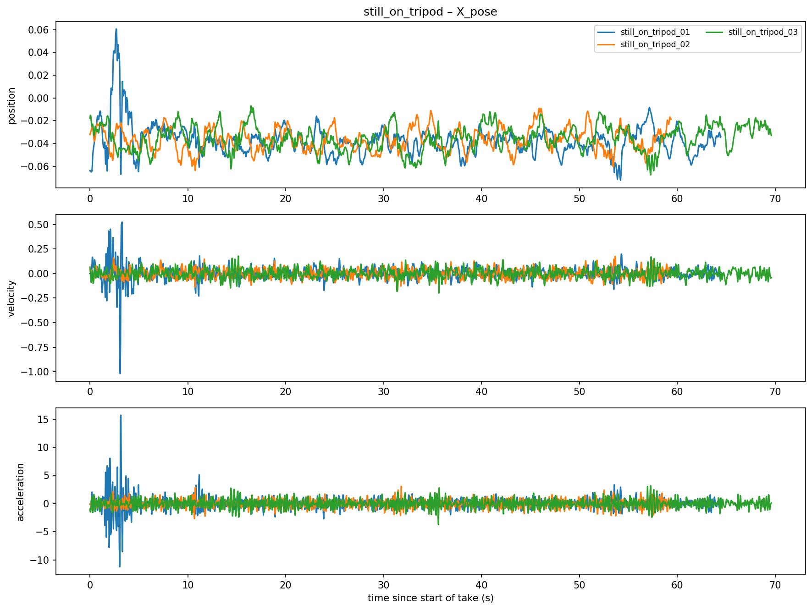 |

**What these plots show**

- Each colour is one **take** within the same scenario.
- The top subplot shows that handheld-still shots have small but visible drift compared to tripod shots.
- Velocity and acceleration subplots reveal that handheld-still motion has more variation than tripod, but remains bounded compared to fast or travel moves.

This gives an overview of intra-scenario consistency and confirms that the data captures the intended motion classes.

---

### 4.3 Sigma and InterpSpeed per scenario

_(Rolling σ and corresponding adaptive interpolation speed)_

**Command**

```bash
docker compose run --rm linear \
  python linear_sigma_model.py \
    --input data/derived/tracking_derivatives.csv \
    --output data/modeled/tracking_modelled_sigma.csv \
    --config-output data/config/linear_sigma_ranges.json \
    --plot-scenario controlled_handheld_pan \
    --plot-axis Y_rot
```

Output example:

- `data/plots/linear_model_scenarios/controlled_handheld_pan_Y_rot.jpg`
- `data/plots/linear_model_scenarios/fast_pan_tripod_Y_rot.jpg` (from `--plot-scenario fast_pan_tripod`)

| controlled_handheld_pan – Y_rot                                                                       | fast_pan_tripod – Y_rot                                                               |
| ----------------------------------------------------------------------------------------------------- | ------------------------------------------------------------------------------------- |
| 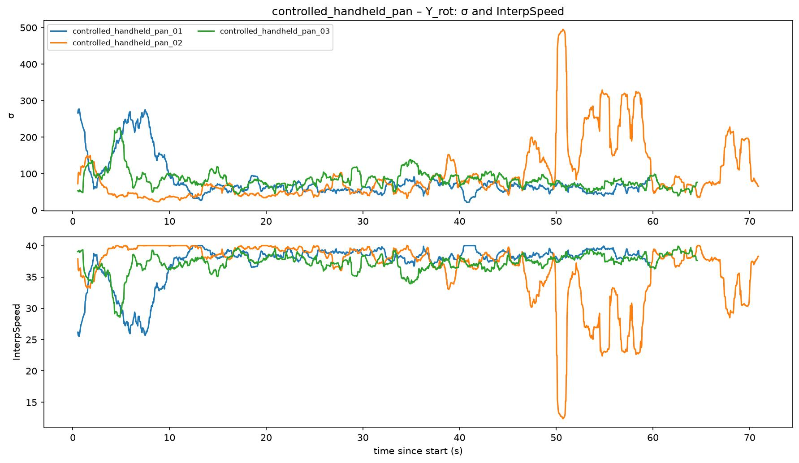 | 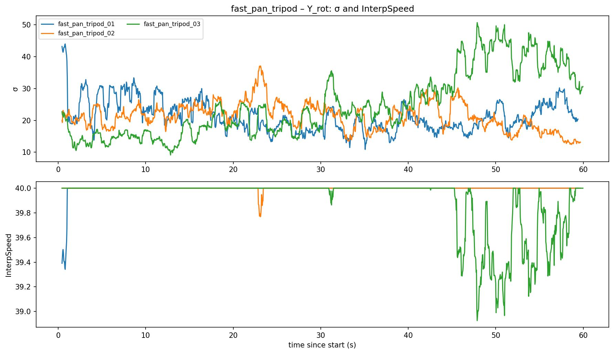 |

**What these plots show**

- The top subplot is the rolling **σ of angular acceleration** on Y (instability measure).
- The bottom subplot is the resulting **InterpSpeed** chosen by the model at each time.
- For **controlled handheld pan**, σ stays moderate and InterpSpeed remains near the maximum, meaning the filter mostly follows the operator.
- For **fast tripod pans**, σ spikes higher and InterpSpeed is periodically reduced, indicating stronger smoothing during high-instability segments.

This demonstrates the adaptive mapping from local motion statistics to damping strength.

---

### 4.4 Sigma bar plots per axis

_(90th percentile σ per scenario, one axis)_

**Command**

```bash
docker compose run --rm linear \
  python linear_sigma_model.py \
    --input data/derived/tracking_derivatives.csv \
    --output data/modeled/tracking_modelled_sigma.csv \
    --config-output data/config/linear_sigma_ranges.json \
    --plot-bar-axis Z_pose
```

Output example:

- `data/plots/linear_model_sigma_bars/sigma_bar_Z_pose.jpg`
- `data/plots/linear_model_sigma_bars/sigma_bar_Z_rot.jpg` (from `--plot-bar-axis Z_rot`)

| σ (90th percentile) – Z_pose                                                 | σ (90th percentile) – Z_rot                                                |
| ---------------------------------------------------------------------------- | -------------------------------------------------------------------------- |
|  | 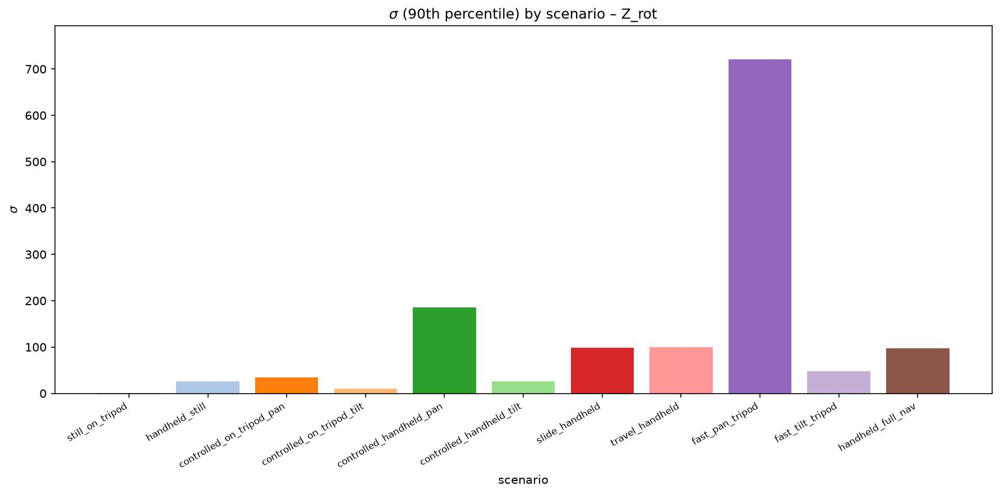 |

**What these plots show**

- Each bar represents the **90th percentile of σ** for one scenario on a given axis.
- Bars are ordered by motion type (tripod, handheld, travel, fast, etc.).
- On Z_pose, only a subset of scenarios produces high σ, reflecting when there is significant depth or vertical movement.
- On Z_rot, aggressive rotational moves show very large σ, clearly separated from static scenarios.

These bar plots justify the choice of `min_sigma` and `max_sigma` per axis and illustrate how σ scales with motion complexity.

---

### 4.5 Smoothing simulation (linear Model) (raw vs smoothed motion, jitter, lag)

**Command**

```bash
docker compose run --rm linear \
  python linear_smoothing_sim.py \
    --logs data/processed/tracking_logs.csv \
    --derived data/derived/tracking_derivatives.csv \
    --config data/config/linear_sigma_ranges.json \
    --axis Y_rot \
    --label fast_pan_tripod_02
```

Output example:

- `data/plots/smoothing/fast_pan_tripod_02_Y_rot.jpg`
- `data/plots/smoothing/fast_tilt_tripod_02_Y_rot.jpg` (from `--label fast_tilt_tripod_02`)

| fast_pan_tripod_02 – Y_rot                                                     | fast_tilt_tripod_02 – Y_rot                                                      |
| ------------------------------------------------------------------------------ | -------------------------------------------------------------------------------- |
|  | 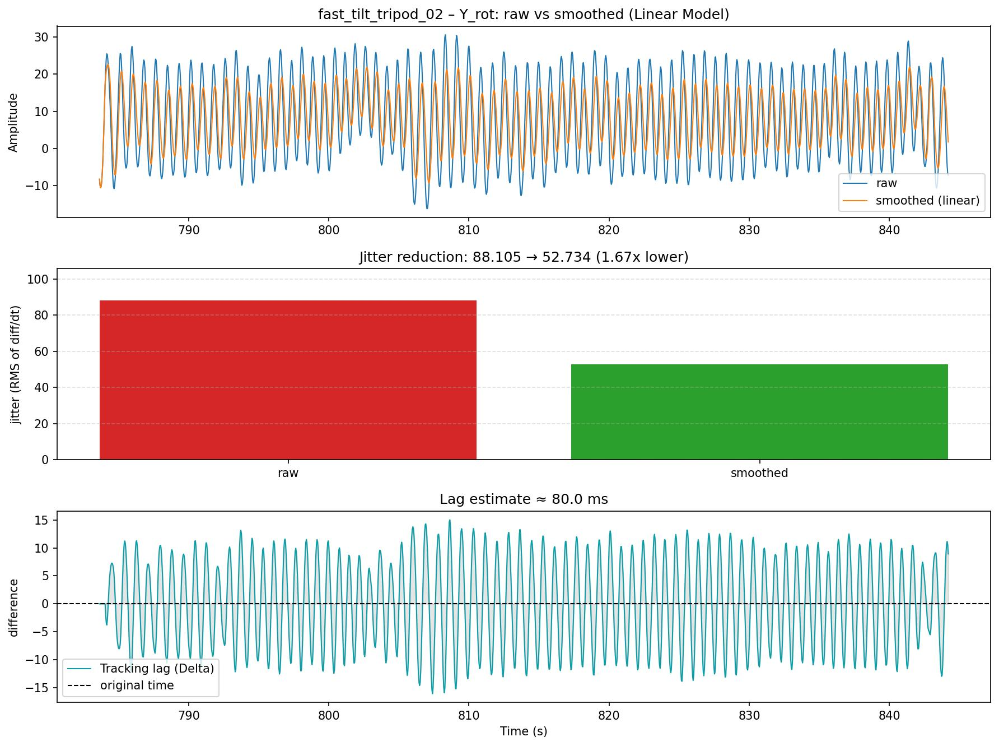 |

**What these plots show**

Each figure has three parts:

1. **Raw vs smoothed motion over time**
   - The orange smoothed curve follows the blue raw curve but removes high-frequency oscillations.

2. **Jitter metric before and after**
   - Bars show the RMS of frame-to-frame differences.
   - A lower value after smoothing indicates reduced jitter; in fast tilt, jitter drops significantly.

3. **Difference and lag estimate**
   - The bottom plot shows `smoothed - raw` over time, with an estimated lag in ms.
   - Fast tilt exhibits more jitter reduction and a small lag (~100 ms); fast pan shows less change and almost zero lag.

These simulations validate that the algorithm behaves as intended: it damps noisy, aggressive motion more strongly while preserving responsiveness where motion is already smooth.

---

### 4.6 Sigma and InterpSpeed per scenario (piecewise model)

**Command**

```bash
docker compose run --rm piecewise \
  python piecewise_sigma_model.py \
    --input data/derived/tracking_derivatives.csv \
    --output data/modeled/tracking_modelled_sigma.csv \
    --config-output data/config/piecewise_sigma_ranges.json \
    --plot-scenario fast_pan_tripod \
    --plot-axis Y_rot
```

Output example:

- `data/piecewise_plots/piecewise_model_scenarios/controlled_handheld_pan_Y_rot_piecewise.jpg`
- `data/piecewise_plots/piecewise_model_scenarios/fast_pan_tripod_Y_rot_piecewise.jpg`

| controlled_handheld_pan – Y_rot                                                                                              | fast_pan_tripod – Y_rot                                                                                      |
| ---------------------------------------------------------------------------------------------------------------------------- | ------------------------------------------------------------------------------------------------------------ |
| 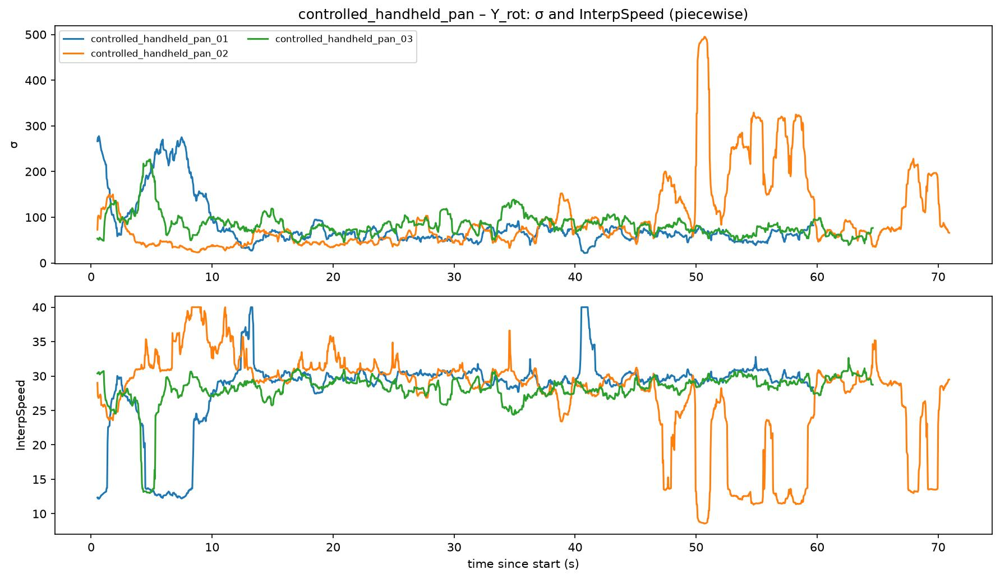 | 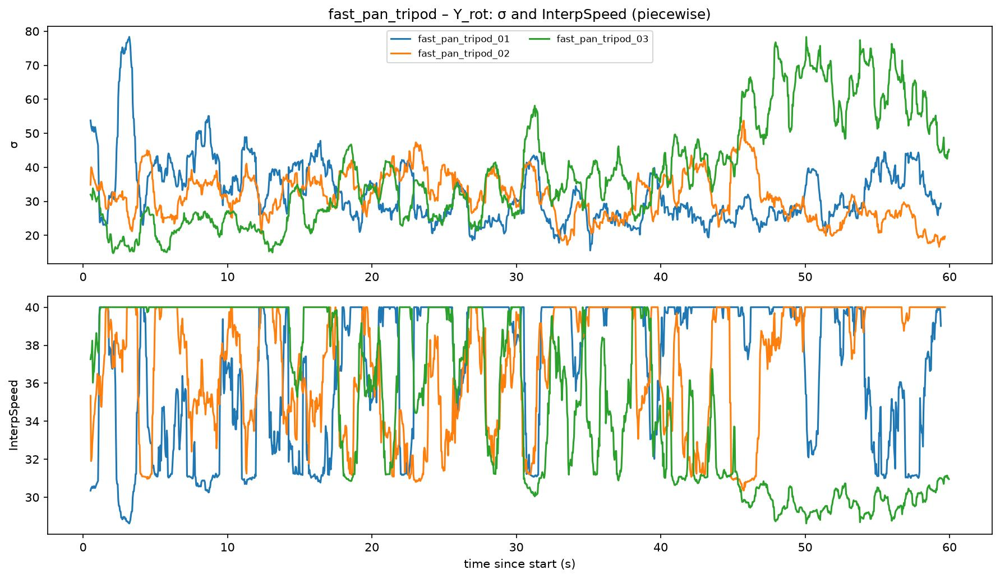 |

**What these plots show**

- The top subplot is the rolling **σ of angular acceleration** on Y (instability measure).
- The bottom subplot is the resulting **InterpSpeed** chosen by the piecewise model at each time.
- For **controlled handheld pan**, σ stays moderate and InterpSpeed remains near the maximum, meaning the filter mostly follows the operator.
- For **fast tripod pans**, σ spikes higher and InterpSpeed is periodically reduced, indicating stronger smoothing during high-instability segments.
  This demonstrates the adaptive mapping from local motion statistics to damping strength using a piecewise function.

---

### 4.7 Sigma bar plots per axis (piecewise model)

**Command**

```bash
docker compose run --rm piecewise \
  python piecewise_sigma_model.py \
    --input data/derived/tracking_derivatives.csv \
    --output data/modeled/tracking_modelled_sigma_piecewise.csv \
    --config-output data/config/piecewise_sigma_ranges.json \
    --plot-bar-axis Z_pose
```

Output example:

- `data/piecewise_plots/piecewise_model_sigma_bars/sigma_bar_Z_pose_piecewise.jpg`
- `data/piecewise_plots/piecewise_model_sigma_bars/sigma_bar_Z_rot_piecewise.jpg`

| σ (90th percentile) – Z_pose                                                                        | σ (90th percentile) – Z_rot                                                                       |
| --------------------------------------------------------------------------------------------------- | ------------------------------------------------------------------------------------------------- |
| 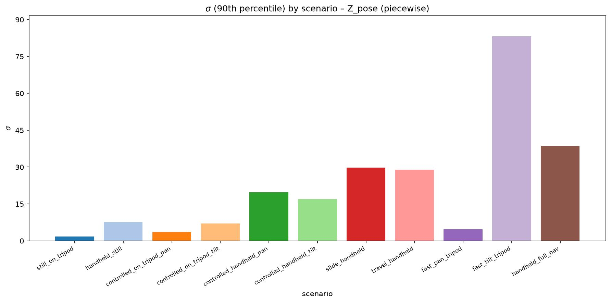 | 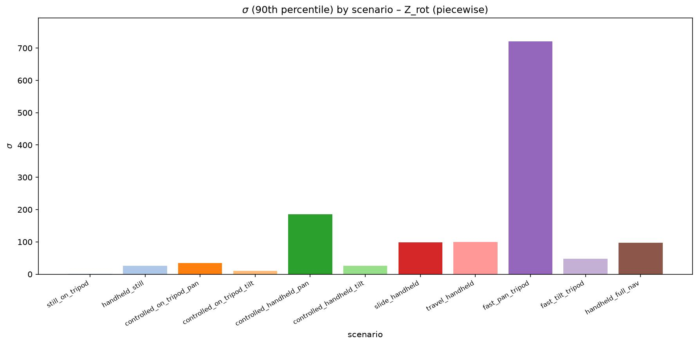 |

**What these plots show**

- Each bar represents the **90th percentile of σ** for one scenario on a given axis.
- Bars are ordered by motion type (tripod, handheld, travel, fast, etc.).
- On Z_pose, only a subset of scenarios produces high σ, reflecting when there is significant depth or vertical movement.
- On Z_rot, aggressive rotational moves show very large σ, clearly separated from static scenarios.
  These bar plots justify the choice of σ-breaks and speed levels per axis and illustrate how σ scales with motion complexity.

---

### 4.8 Smoothing simulation (piecewise model) (raw vs smoothed motion, jitter, lag)

**Command**

```bash
docker compose run --rm piecewise\
   python piecewise_smoothing_sim.py\
        --logs data/processed/tracking_logs.csv\
        --derived data/derived/tracking_derivatives.csv\
        --config data/config/piecewise_sigma_ranges.json\
        --axis Y_rot\
        --label fast_pan_tripod_02
```

Output example:

- `data/piecewise_plots/smoothing/fast_pan_tripod_02_Y_rot_piecewise.jpg`
- `data/piecewise_plots/smoothing/controlled_handheld_pan_03_Y_rot_piecewise.jpg`

| fast_pan_tripod_02 – Y_rot                                                                         | controlled_handheld_pan_03 – Y_rot                                                                                 |
| -------------------------------------------------------------------------------------------------- | ------------------------------------------------------------------------------------------------------------------ |
| 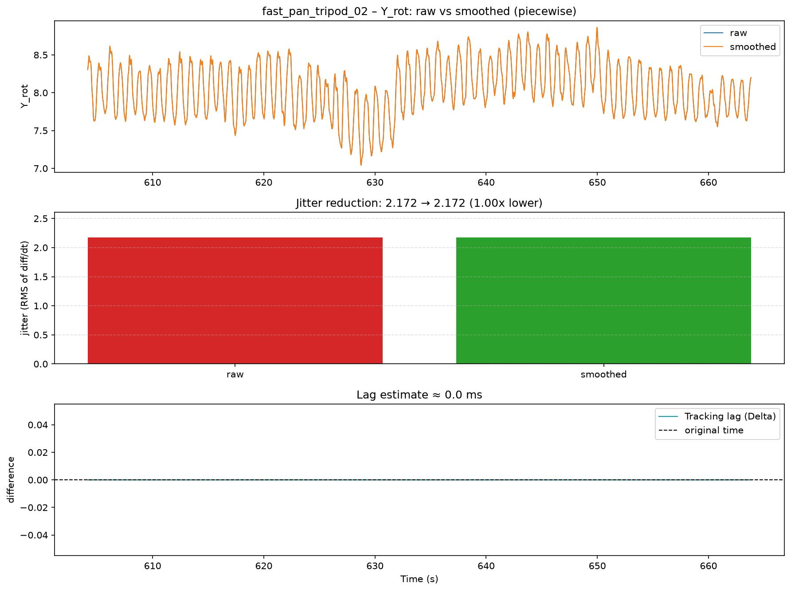 | 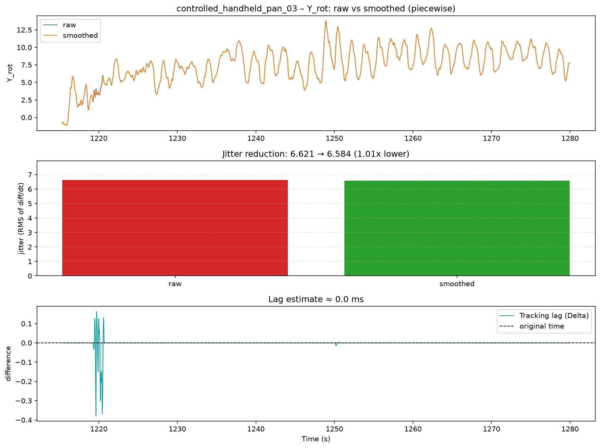 |

**What these plots show**
Each figure has three parts:

1. **Raw vs smoothed motion over time**
   - The orange smoothed curve follows the blue raw curve but removes high-frequency oscillations.
2. **Jitter metric before and after**
   - Bars show the RMS of frame-to-frame differences.
   - A lower value after smoothing indicates reduced jitter; in fast tilt, jitter drops significantly.
3. **Difference and lag estimate**
   - The bottom plot shows `smoothed - raw` over time, with an estimated lag in ms.
   - Fast tilt exhibits more jitter reduction and a small lag (~100 ms); fast pan shows less change and almost zero lag.
     These simulations validate that the piecewise algorithm behaves as intended: it damps noisy, aggressive motion more strongly while preserving responsiveness where motion is already smooth.

---

### 4.9 Sigma and InterpSpeed per scenario (sigmoid model)

**Command**

```bash
docker compose run --rm sigmoid \
  python sigmoid_sigma_model.py \
    --input data/derived/tracking_derivatives.csv \
    --output data/modeled/tracking_modelled_sigma_sigmoid.csv \
    --config-output data/config/sigmoid_sigma_ranges.json \
    --plot-scenario fast_pan_tripod \
    --plot-axis Y_rot
```

Output example:

- `data/sigmoid_plots/sigmoid_model_scenarios/controlled_handheld_pan_Y_rot.jpg`
- `data/sigmoid_plots/sigmoid_model_scenarios/fast_pan_tripod_Y_rot.jpg`

| controlled_handheld_pan – Y_rot                                                                                | fast_pan_tripod – Y_rot                                                                        |
| -------------------------------------------------------------------------------------------------------------- | ---------------------------------------------------------------------------------------------- |
| 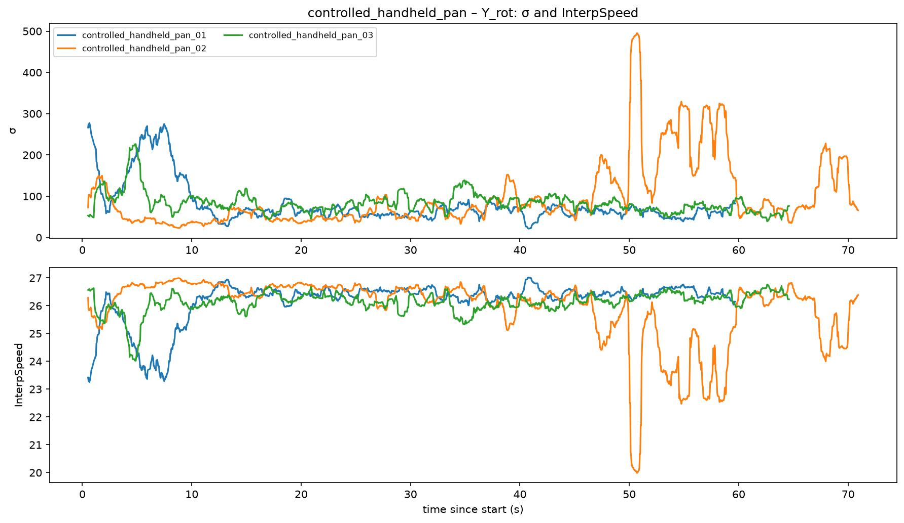 | 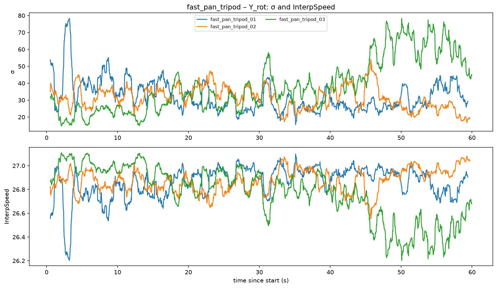 |

**What these plots show**

- The top subplot is the rolling **σ of angular acceleration** on Y (instability measure).
- The bottom subplot is the resulting **InterpSpeed** chosen by the sigmoid model at each time.
- For **controlled handheld pan**, σ stays moderate and InterpSpeed remains near the maximum, meaning the filter mostly follows the operator.
- For **fast tripod pans**, σ spikes higher and InterpSpeed is periodically reduced, indicating stronger smoothing during high-instability segments.
  This demonstrates the adaptive mapping from local motion statistics to damping strength using a sigmoid function.

---

### 4.10 Sigma bar plots per axis (sigmoid model)

**Command**

```bash
docker compose run --rm sigmoid \
  python sigmoid_sigma_model.py \
    --input data/derived/tracking_derivatives.csv \
    --output data/modeled/tracking_modelled_sigma_sigmoid.csv \
    --config-output data/config/sigmoid_sigma_ranges.json \
    --plot-bar-axis Z_pose
```

Output example:

- `data/sigmoid_plots/sigmoid_model_sigma_bars/sigma_bar_Z_pose.jpg`
- `data/sigmoid_plots/sigmoid_model_sigma_bars/sigma_bar_Z_rot.jpg`

| σ (90th percentile) – Z_pose                                                          | σ (90th percentile) – Z_rot                                                         |
| ------------------------------------------------------------------------------------- | ----------------------------------------------------------------------------------- |
|  |  |

**What these plots show**

- Each bar represents the **90th percentile of σ** for one scenario on a given axis.
- Bars are ordered by motion type (tripod, handheld, travel, fast, etc.).
- On Z_pose, only a subset of scenarios produces high σ, reflecting when there is significant depth or vertical movement.
- On Z_rot, aggressive rotational moves show very large σ, clearly separated from static scenarios.
  These bar plots justify the choice of sigmoid inflection points and speed bounds per axis and illustrate how σ scales with motion complexity.

---

### 4.11 Smoothing simulation (sigmoid model) (raw vs smoothed motion, jitter, lag)

**Command**

```bash
docker compose run --rm sigmoid\
   python sigmoid_smoothing_sim.py\
        --logs data/processed/tracking_logs.csv\
        --derived data/derived/tracking_derivatives.csv\
        --config data/config/sigmoid_sigma_ranges.json\
        --axis Y_rot\
        --label fast_pan_tripod_02
```

Output example:

- `data/sigmoid_plots/smoothing/fast_pan_tripod_02_Y_rot_sigmoid.jpg`
- `data/sigmoid_plots/smoothing/controlled_handheld_pan_03_Y_rot_sigmoid.jpg`

| fast_pan_tripod_02 – Y_rot                                                                     | controlled_handheld_pan_03 – Y_rot                                                                             |
| ---------------------------------------------------------------------------------------------- | -------------------------------------------------------------------------------------------------------------- |
| 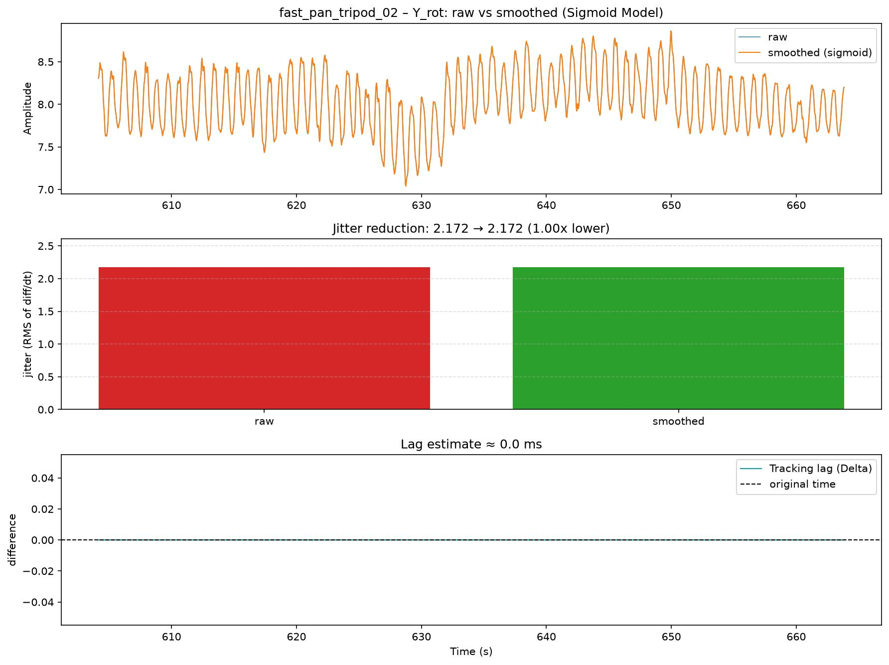 | 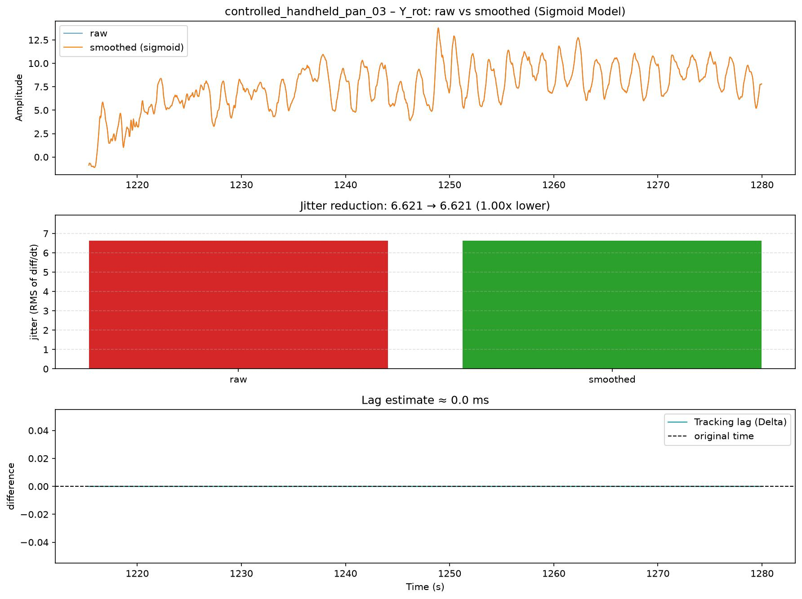 |

**What these plots show**

- Each figure has three parts:

1. **Raw vs smoothed motion over time**
   - The orange smoothed curve follows the blue raw curve but removes high-frequency oscillations.
2. **Jitter metric before and after**
   - Bars show the RMS of frame-to-frame differences.
   - A lower value after smoothing indicates reduced jitter; in fast tilt, jitter drops significantly.
3. **Difference and lag estimate**
   - The bottom plot shows `smoothed - raw` over time, with an estimated lag in ms.
   - Fast tilt exhibits more jitter reduction and a small lag (~ 0.0 ms); fast pan shows less change as this level of speed is classified as intentional.
   - These simulations validate that the sigmoid algorithm behaves as intended: it damps noisy, aggressive motion more strongly while preserving responsiveness where motion is already smooth.

---

### 4.12 Velocity distribution analysis (One Euro filter)

_(Per-axis |velocity| distribution for a specific scenario or across scenario groups)_

Unlike the sigma models, the One Euro filter does not calibrate bounds from acceleration statistics. Instead, the two parameters that govern its behaviour — `fc_min` and `beta` — are chosen with reference to the speed range the filter will encounter at runtime. The velocity distribution plots produced by `one_euro_filter_model.py` provide that reference.

The plotting CLI supports two modes:

- **Scenario-specific** (`--plot-axis` + `--plot-scenario`): plots the |velocity| histogram for a single named scenario. Useful for examining the speed profile of one motion type directly.
- **Group overview** (`--plot-axis` alone): overlays stable and fast scenario groups as two histograms. Useful as a global reference for setting `fc_min` and `beta` across the full dataset.

In both modes, running the script without `--plot-axis` still computes and writes the config JSON — no plot is generated unless the argument is provided.

**Command (scenario-specific)**

```bash
docker compose run --rm one_euro \
  python one_euro_filter_model.py \
    --logs data/processed/tracking_logs.csv \
    --derived data/derived/tracking_derivatives.csv \
    --plot-axis Y_rot \
    --plot-scenario fast_pan_tripod
```

**Command (group overview)**

```bash
docker compose run --rm one_euro \
  python one_euro_filter_model.py \
    --logs data/processed/tracking_logs.csv \
    --derived data/derived/tracking_derivatives.csv \
    --plot-axis Y_rot
```

Output example (scenario-specific):

- `data/one_euro_plots/analysis/Y_rot_fast_pan_tripod_velocity_distribution.jpg`
- `data/one_euro_plots/analysis/X_pose_fast_pan_tripod_velocity_distribution.jpg` (from `--plot-axis X_pose --plot-scenario fast_pan_tripod`)

| Y_rot – fast_pan_tripod                                                                                                          | X_pose – fast_pan_tripod                                                                                                           |
| -------------------------------------------------------------------------------------------------------------------------------- | ---------------------------------------------------------------------------------------------------------------------------------- |
| 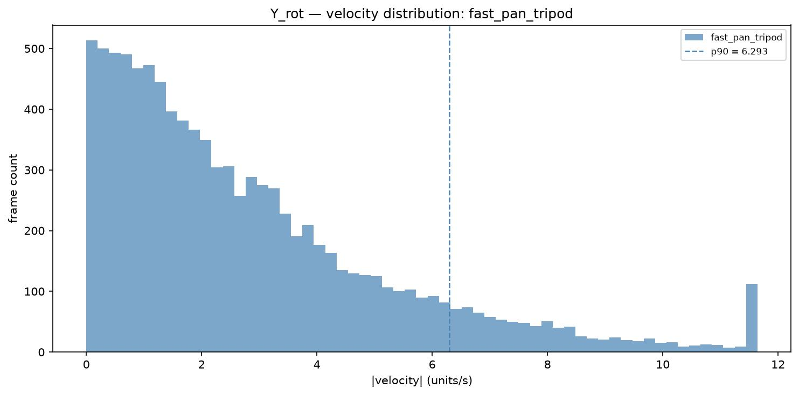                    | 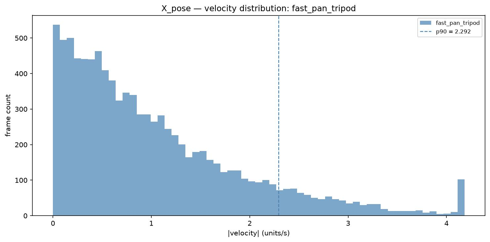                    |

**What these plots show**

- In scenario-specific mode, a single histogram shows the |velocity| distribution for that scenario, with a dashed line marking the 90th percentile speed.
- In group overview mode, stable and fast scenario groups are overlaid, with separate p90 lines for each group.
- The **p90** value is the primary tuning reference: `fc_min` should keep the filter smoothing at the stable p90 speed, and `beta` should open the cutoff to near-transparency by the fast p90 speed.

Per-axis overrides can be passed on the CLI if individual axes require different parameters:

```bash
docker compose run --rm one_euro \
  python one_euro_filter_model.py \
    --fc-min 0.5 --beta 0.05 \
    --fc-min-x-rot 0.3 --beta-x-rot 0.08
```

---

### 4.13 Smoothing simulation (One Euro filter) (raw vs filtered motion, jitter, lag)

**Command**

```bash
docker compose run --rm one_euro \
  python one_euro_smoothing_sim.py \
    --logs data/processed/tracking_logs.csv \
    --config data/config/one_euro_params.json \
    --axis Y_rot \
    --label fast_pan_tripod_02
```

Output example:

- `data/one_euro_plots/smoothing/fast_pan_tripod_02_Y_rot_one_euro.jpg`
- `data/one_euro_plots/smoothing/still_on_tripod_01_Y_rot_one_euro.jpg` (from `--label still_on_tripod_01`)

| fast_pan_tripod_02 – Y_rot                                                                             | still_on_tripod_01 – Y_rot                                                                             |
| ------------------------------------------------------------------------------------------------------ | ------------------------------------------------------------------------------------------------------ |
| 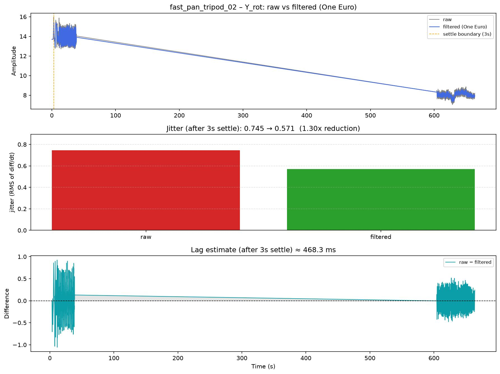       | 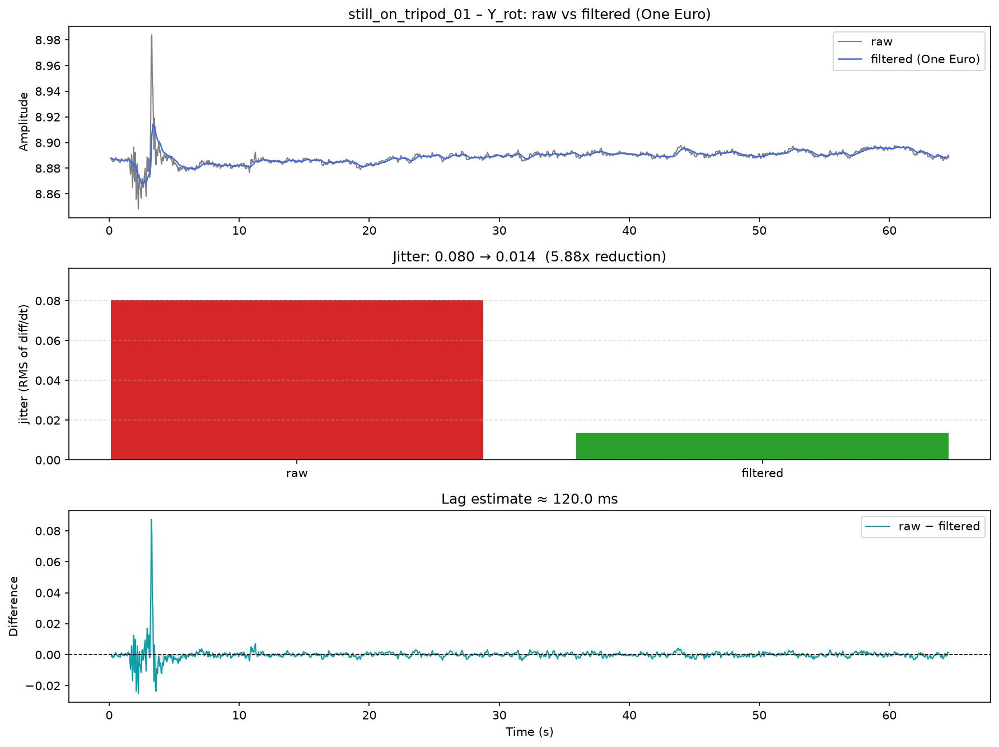       |

**What these plots show**

Each figure has three parts:

1. **Raw vs filtered motion over time (full take)**
   - The full take is shown, including the initial filter convergence window. A vertical dashed orange line marks the settle boundary (default: 3 seconds from the first valid sample), indicating where steady-state metric computation begins.
   - The filtered curve tracks the raw signal closely during fast motion and damps it during slow or stationary segments.
   - Unlike the sigma models, there is no fixed interpolation speed — the filter cutoff adapts continuously every frame based on instantaneous signal velocity.

2. **Jitter metric before and after (settled region only)**
   - Bars show the RMS of frame-to-frame differences, normalised by mean frame time, computed only on frames after the settle boundary.
   - Excluding the convergence window ensures the metric reflects steady-state filter behaviour rather than the initial transient.
   - A held shot should show strong jitter reduction. A fast pan should show near-zero reduction, confirming the filter is not introducing smoothing lag where the motion is intentional.

3. **Difference and lag estimate (settled region only)**
   - The bottom plot shows `raw − filtered` over the settled region, with a cross-correlation lag estimate in milliseconds.
   - A well-tuned One Euro filter produces near-zero lag on fast motion and visible smoothing depth on slow or stable motion — the two conditions are controlled independently by `fc_min` and `beta` respectively.

The settle window can be adjusted with `--settle-seconds` (default: 3.0). Set it to 0 to compute metrics over the full take:

```bash
docker compose run --rm one_euro \
  python one_euro_smoothing_sim.py \
    --logs data/processed/tracking_logs.csv \
    --config data/config/one_euro_params.json \
    --axis Y_rot \
    --label still_on_tripod_01 \
    --settle-seconds 5.0
```

The simulation can also be invoked by scenario and take number instead of label:

```bash
docker compose run --rm one_euro \
  python one_euro_smoothing_sim.py \
    --logs data/processed/tracking_logs.csv \
    --config data/config/one_euro_params.json \
    --axis X_pose \
    --scenario still_on_tripod \
    --take 1
```

---

## **This process can be replicated for any other models implemented in the repo, for all axes and labels present in the dataset.**

### 4.14 Linear Smoothing VS Piecewise Smoothing VS Sigmoid Smoothing VS One Euro Filter Comparison

| Linear Model – controlled_handheld_pan – Y_rot                                              | Piecewise Model – controlled_handheld_pan – Y_rot                                                               | Sigmoid Model – controlled_handheld_pan – Y_rot                                                             | One Euro Filter – controlled_handheld_pan – Y_rot                                                                         |
| ------------------------------------------------------------------------------------------- | --------------------------------------------------------------------------------------------------------------- | ----------------------------------------------------------------------------------------------------------- | ------------------------------------------------------------------------------------------------------------------------- |
| 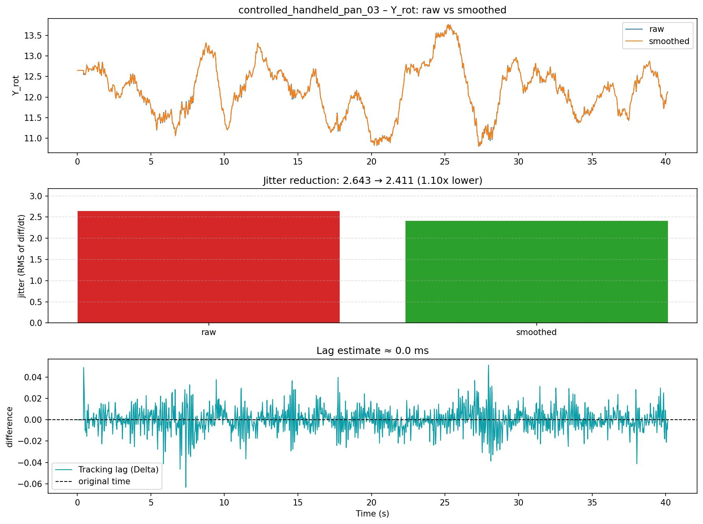 |  |  | 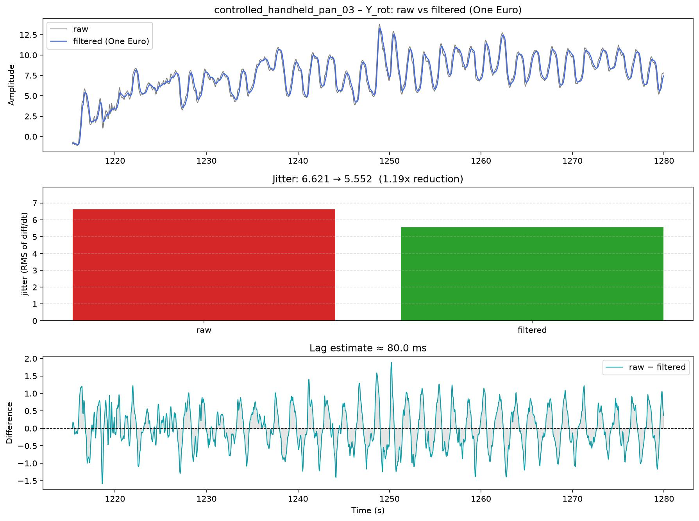 |

**What these plots show**

- ### Linear Model:
  - The linear mapping is conservative. It reduces jitter a bit, but it is clearly prioritising responsiveness by remaining very close to the raw signal.
  - The model is a good "safe default". It does not affect the signal much. It applies small corrections when the motion is very jittery. Otherwise, it remains very close to the raw signal.
  - This makes the model very useful in certain use cases, where simple jitter reduction is desired, while responsiveness is of highest priority.

- ### Piecewise Model:
  - The piecewise mapping is more aggressive generally. It removes more high-frequency energy while still keeping the signal aligned in time.
  - The model is a "strong stabilizer". It applies larger level of smoothness, and is more sensitive to jitter variations, thanks to the multiple breakpoints.
  - Even with more smoothing, the lag produced by the model is essentially the same as the linear model. This proves the piecewise model ability to generalize over most use cases without introducing additional latency.

- ### Sigmoid Model:
  - The sigmoid mapping sits between the linear and piecewise models. It is the nonlinear model among the sigma-based set.
  - Like the linear model, it balances the signal across two ends of the range, but unlike the linear model, the transition between those two ends is nonlinear, following a sigmoid curve.
  - Unlike the piecewise model, it does not have multiple breakpoints, but rather a smooth transition between the two ends of the range.
  - The model is a "balanced stabilizer". It applies moderate levels of smoothness and steps gradually between jitter variations.
  - The lag produced by the model is also essentially the same as the linear and piecewise models in most cases.

- ### One Euro Filter:
  - The One Euro filter operates on a fundamentally different principle from the three sigma models. Rather than computing rolling acceleration statistics and mapping them to a fixed interpolation speed, it estimates the instantaneous velocity of the signal every frame and uses that to set its own cutoff frequency continuously.
  - On a stable held shot, the filter behaves as a strong low-pass filter with cutoff near `fc_min`, suppressing jitter with no required calibration to rig-specific acceleration bounds.
  - On a fast pan, the cutoff rises proportionally to `beta * |velocity|`, allowing the filter to become nearly transparent. The transition between these two states is smooth and continuous rather than stepped.
  - Because the parameters (`fc_min`, `beta`) describe desired output behaviour rather than measured sensor statistics, the filter generalises across different rigs and recording conditions without recalibration. This is the key distinguishing property compared to the sigma models.
  - The expected lag on fast motion is near zero. On slow or stable motion, the filter introduces smoothing depth controlled by `fc_min`, with no fixed lag offset.

- ### Comparative Analysis:
  - The sigma models (linear, piecewise, sigmoid) derive their smoothing strength from a rolling window of acceleration. This makes them well-suited to rigs where the noise statistics are stable and known from a calibration dataset. The piecewise model offers the finest control within this family, the sigmoid the smoothest transition, and the linear the simplest baseline.
  - The One Euro filter does not require a calibration dataset. Its two parameters are tuned against the velocity distribution plots (§4.12) and confirmed with the simulation (§4.13). This makes it the preferred choice when recording conditions change, the rig is updated, or when a new dataset is not available for recalibration.
  - In terms of role in the system: the linear model serves as the Safe/Basic Control (Basic Mode), the piecewise model as the Manual/Specific Control (Expert Mode), the sigmoid model as the Organic/Automated Control (Smart Mode), and the One Euro filter as the Adaptive/Hardware-Agnostic Mode.

  Ultimately, the choice of model depends on the specific requirements of the application, the stability of the recording setup, and the degree to which recalibration is feasible between sessions.

---

## 5. Runtime implementation

- The logic demonstrated in `<any_model>_smoothing_sim.py` and `one_euro_smoothing_sim.py` was used as pseudo-code for building the C++ scripts and Blueprints inside Unreal Engine.
- The flexibility offered by the system allowed implementing all models in Unreal Engine's runtime with a shared interface, switchable from within the editor.
- The configuration files generated by each model script (`<model>_sigma_ranges.json`, `one_euro_params.json`) were used to set up the parameters inside Unreal Engine. This ensured consistency between the offline analysis and the real-time implementation.
- Once the parameters were set for each model, it was possible to switch between different models from within Unreal Engine.
- Each sigma-based model applies its own smoothing logic while adhering to the same overall principles:
  - Maintain a per-axis acceleration buffer.
  - Compute rolling σ with a fixed window size.
  - Map σ to InterpSpeed using pre-computed bounds.
  - Apply FInterpTo each frame.
- The One Euro filter follows a different runtime path:
  - Maintain per-axis filter state (previous filtered value, previous filtered derivative, previous timestamp).
  - Compute instantaneous velocity via causal backward difference on the filtered signal.
  - Smooth the derivative with a fixed-cutoff EMA.
  - Compute the adaptive cutoff: `fc = fc_min + beta * |smoothed_derivative|`.
  - Apply the adaptive EMA to the primary signal.
  - For rotation axes, apply angle unwrapping before filtering and wrap output back to (−180, 180] degrees.
- The implemented functionality to calculate the average speed on the positional axes was utilised to update the shader material of the scanned object dynamically. This fulfils the requirements of the shader programming task and extends the work applied on the visualisation task.

---

## 6. Validation Pipeline

Unlike the simulation pipeline, the bash script running the validation service triggers `validator.py` to automatically compute the metrics and generate the plots of all labels and axes in every available _.log_ file placed in `data/validation/raw/`. With that said, the validation script can also be run on files individually with custom CLI command using the argument "--file".

**Command**

```bash
docker compose run --rm validation\
    python validator.py\
        --file data/validation/raw/<log_file>.log
```

### 6.1 Parsing Runtime Logs

- After obtaining raw Unreal Engine logs from the runtime implementation, the first step is to parse these logs to extract relevant tracking data. This is done using the `parse_validation.py` script.
- From there, `validator.py` computes the key metrics and generates the validation plots.

### 6.2 Validation Metrics

- The validation process focuses on several key metrics to assess the performance of the smoothing algorithms:
  - **RMS Error**: Measures the root mean square error between the raw and smoothed trajectories.
  - **Lag**: Estimates the time delay introduced by the smoothing process.
  - **Jitter**: Quantifies the high-frequency noise present in the motion data.
  - **Smoothness**: Evaluates the overall smoothness of the trajectory after applying the smoothing algorithm.

### 6.3 Validation Plots

#### 6.3.1 Core Functionality

- The validation scripts generate a series of plots to visually compare the raw and smoothed trajectories:
  - **Trajectory Comparison**: Plots showing raw vs smoothed motion over time.
  - **Jitter Reduction**: Bar charts illustrating the reduction in jitter before and after smoothing.
  - **Lag Estimation**: Graphs depicting the difference between smoothed and raw signals, along with estimated lag values.

**_Example:_**

- `data/validation/plots/linear_test_01/X_rot_validation.jpg`

| linear test_01 (runtime) – Y_pose                                                                           |
| ----------------------------------------------------------------------------------------------------------- |
| 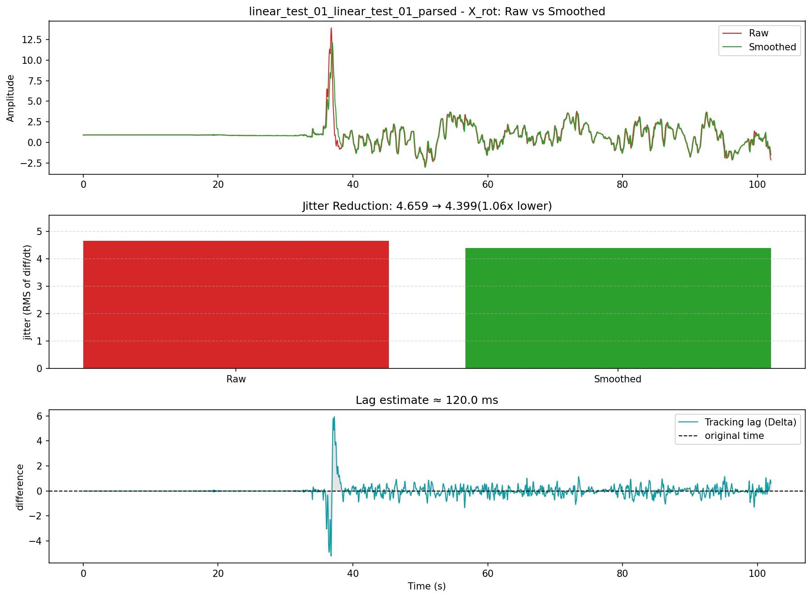 |

**What these plots show**

- The top part of the figure shows the raw vs smoothed motion over time for the specified axis.
- The middle part displays the jitter metric before and after smoothing, indicating the effectiveness of the algorithm in reducing high-frequency noise.
- The bottom part illustrates the difference between the smoothed and raw signals, along with an estimated lag value in milliseconds.

#### 6.3.2 Poly-model Comparison

- The validation pipeline can utilize the 6DOF version of the processed logs. This version can be used as input to any of the simulation scripts (`<model>_smoothing_sim.py`, `one_euro_smoothing_sim.py`). This allows users to see how a shot would have behaved if any of the models were applied during runtime.
- This provides valuable insights into the comparative performance of different smoothing algorithms on the same shot or scenario.

**_Example 1 (Set to Linear Model at Runtime):_**

**Command**

```bash
docker compose run --rm piecewise \
  python piecewise_smoothing_sim.py \
      --logs data/validation/simulate/linear_test_01_sim.csv \
      --derived data/validation/simulate/linear_test_01_sim_derivatives.csv \
      --config data/config/piecewise_sigma_ranges.json \
      --axis X_rot \
      --label linear_test_01
```

output example:

- `data/validation/plots/raw_nav/X_rot_validation.jpg`
- `data/piecewise_plots/smoothing/raw_nav_X_rot_piecewise.jpg`

| linear test_01 (runtime) – Z_rot                                                                            | linear test_01 (piecewise simulation) –Z_rot                                                        |
| ----------------------------------------------------------------------------------------------------------- | --------------------------------------------------------------------------------------------------- |
| 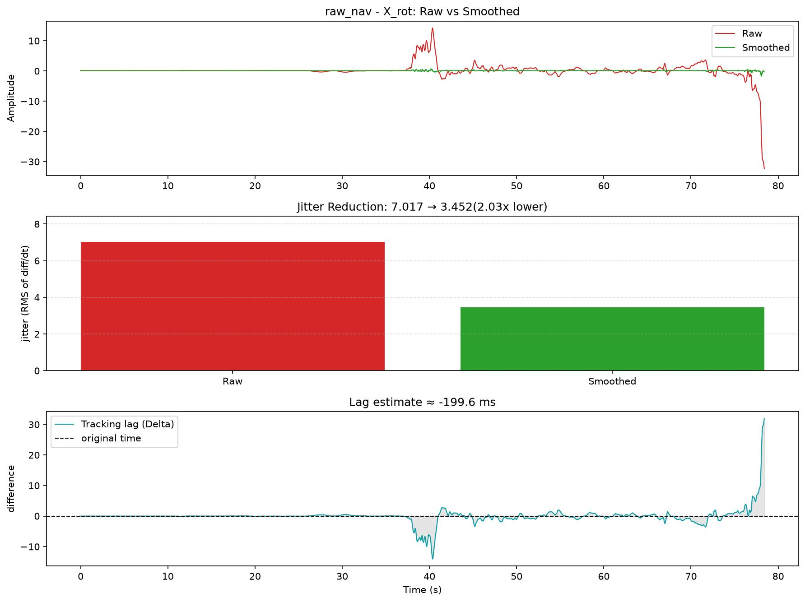 | 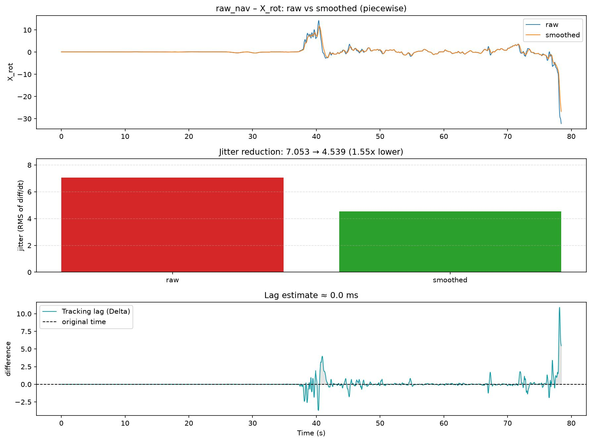 |

**What these plots show**

- These plots show side by side how a specific axis would behave in this shot if the piecewise model was selected at runtime.

**_Example 2 (Set to Linear Model at Runtime):_**

**Command**

```bash
docker compose run --rm sigmoid \
  python sigmoid_smoothing_sim.py \
      --logs data/validation/simulate/raw_nav_sim.csv \
      --derived data/validation/simulate/raw_nav_sim_derivatives.csv \
      --config data/config/sigmoid_sigma_ranges.json \
      --axis Y_pose \
      --label raw_nav
```

output example:

- `data/validation/plots/raw_nav/Y_pose_validation.jpg`
- `data/sigmoid_plots/smoothing/raw_nav_Y_pose_sigmoid.jpg`

| raw_nav (runtime) – Y_pose                                                                                  | raw_nav (sigmoid simulation) – Y_pose                                                   |
| --------------------------------------------------------------------------------------------------------------------- | ------------------------------------------------------------------------------------------------- |
| 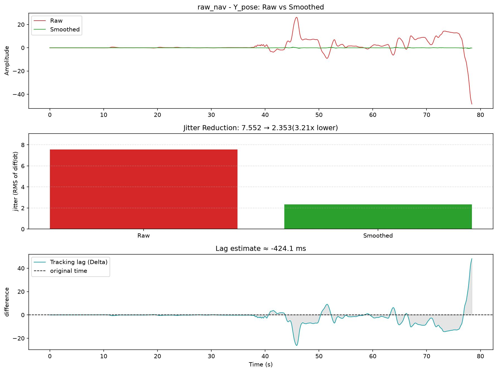 | 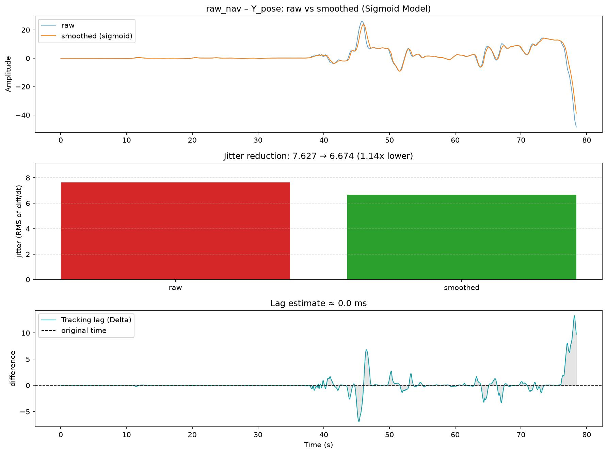 |

**What these plots show**

- These plots show side by side how a specific axis would behave in this shot if the sigmoid model was selected at runtime.

The One Euro filter simulation script can be used in the same way. For a shot recorded at runtime under any model, the 6DOF CSV from `data/validation/simulate/` can be passed directly to `one_euro_smoothing_sim.py`:

```bash
docker compose run --rm one_euro \
  python one_euro_smoothing_sim.py \
      --logs data/validation/simulate/<label>_sim.csv \
      --config data/config/one_euro_params.json \
      --axis Y_rot \
      --label <label>
```

This produces a plot under `data/one_euro_plots/smoothing/` showing how the One Euro filter would have performed on the same shot, enabling direct comparison with the runtime result and with the other model simulations.

---

**Findings:** _The setup allows for direct comparative analysis between the different models, without the complexity and hassle of replicating the exact same physical camera movement for another test shot, which requires extensive setup and expensive machinery like advanced robotic arms._

---

#### 6.3.3 Mono-model Comparison

- The same 6DOF version of the processed logs can be utilized as the input of the simulation script corresponding to the model used during runtime.
- This allows users to validate the performance of the specific model across runtime and simulation, ensuring consistency and reliability of the smoothing algorithm.

**_Example 1 (Set to piecewise Model at Runtime and simulation):_**

**Command**

```bash
docker compose run --rm piecewise \
  python piecewise_smoothing_sim.py \
      --logs data/validation/simulate/piecewise_test_01_sim.csv \
      --derived data/validation/simulate/piecewise_test_01_sim_derivatives.csv \
      --config data/config/piecewise_sigma_ranges.json \
      --axis Z_rot \
      --label piecewise_test_01
```

output example:

- `data/validation/plots/piecewise_test_01/Z_rot_validation.jpg`
- `data/piecewise_plots/smoothing/piecewise_test_01_Z_rot_piecewise.jpg`

| piecewise test_01 (runtime) – Z_rot                                                                                  | piecewise test_01 (simulation) –Z_rot                                                                  |
| -------------------------------------------------------------------------------------------------------------------- | ------------------------------------------------------------------------------------------------------ |
| 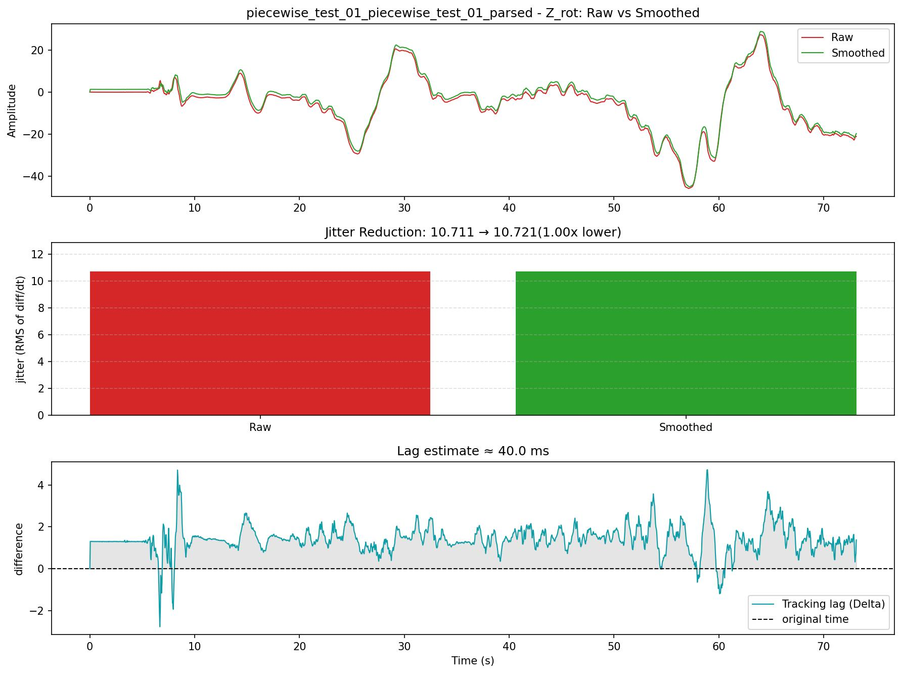 | 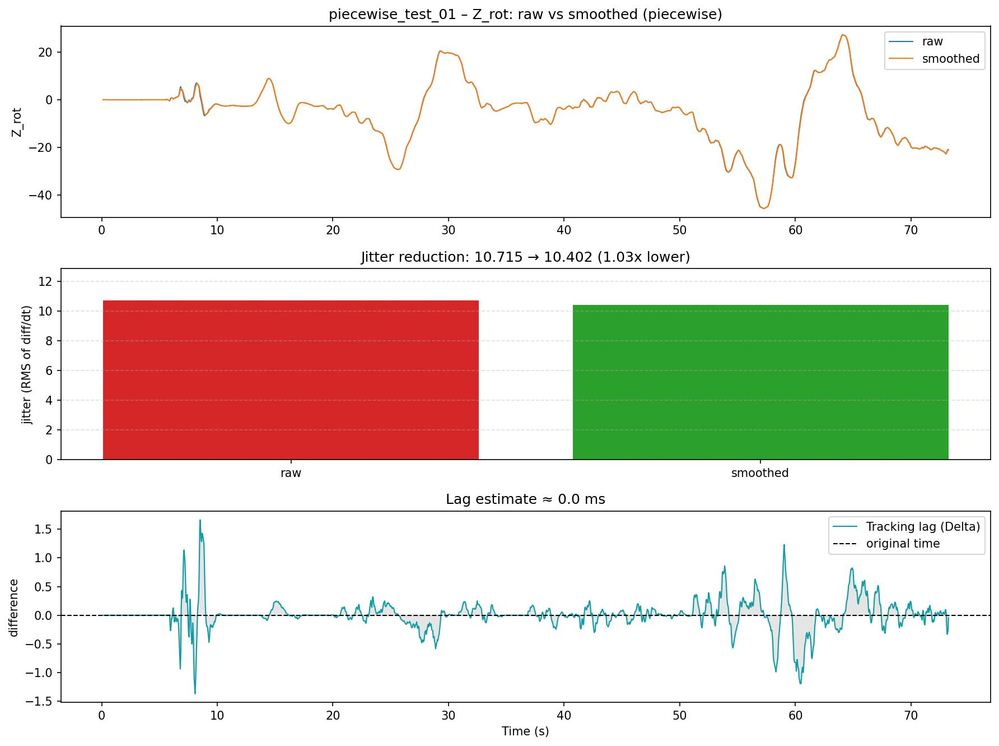 |

**What these plots show**

- The graph shows a side-by-side performance comparison of the piecewise model across the runtime environment and the offline simulation.

**_Example 2 (Set to sigmoid Model at Runtime and simulation):_**

**Command**

```bash
docker compose run --rm sigmoid \
  python sigmoid_smoothing_sim.py \
      --logs data/validation/simulate/sigmoid_test_01_sim.csv \
      --derived data/validation/simulate/sigmoid_test_01_sim_derivatives.csv \
      --config data/config/sigmoid_sigma_ranges.json \
      --axis Z_pose \
      --label sigmoid_test_01
```

- `data/validation/plots/sigmoid_test_01/Z_pose_validation.jpg`
- `data/sigmoid_plots/smoothing/sigmoid_test_01_Z_pose_sigmoid.jpg`

| sigmoid test_01 (runtime) – Z_pose                                                                              | sigmoid test_01 (simulation) –Z_pose                                                            |
| --------------------------------------------------------------------------------------------------------------- | ----------------------------------------------------------------------------------------------- |
| 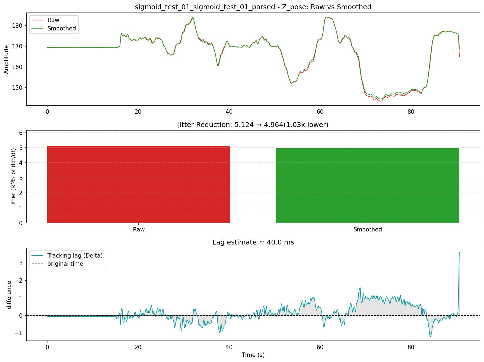 | 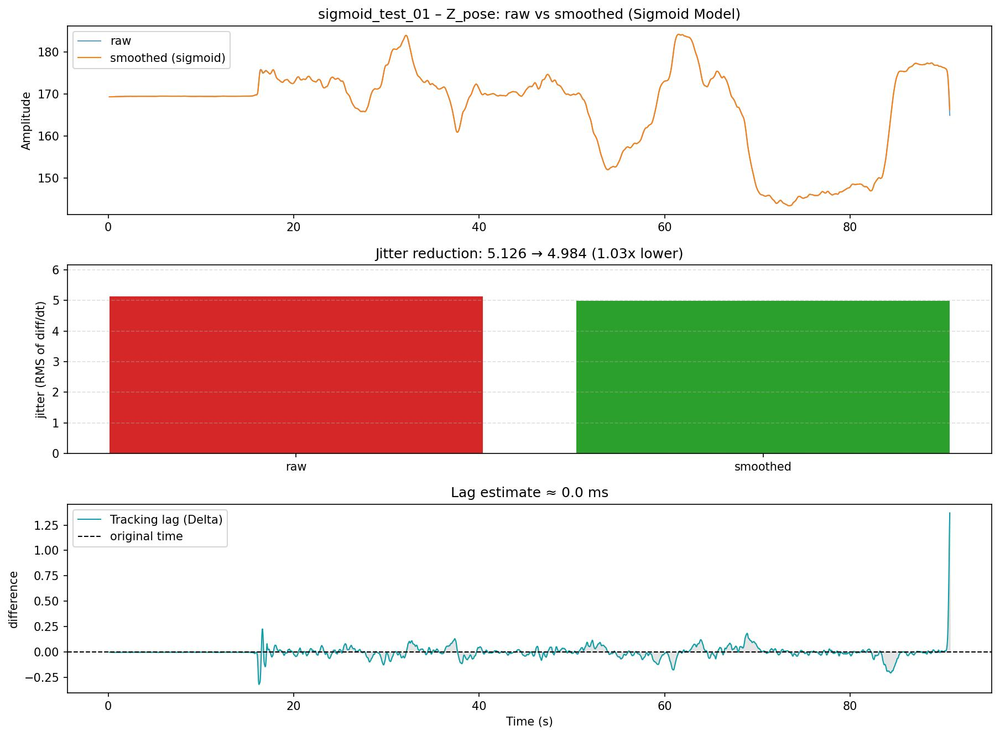 |

**What these plots show**

- The graph shows a side-by-side performance comparison of the sigmoid model across the runtime environment and the offline simulation.

---

**Findings:** _The similarity in both the computational and visual results asserts the models' stability across simulation and runtime. This proves that even with external factors like signal delay, environmental changes during shooting, and others, the models are performing as expected._

---

#### 6.3.4 Conclusive Comparison

By launching the system with `docker compose up --build -d`, if there are any .log files from runtime sessions at `data/validation/raw`, then those files will be processed automatically and generate validation plots for all 6 axes.

| Linear test_01 (runtime) – X_rot                                                                            | Piecewise test_01 (runtime) – X_rot                                                                                  | Sigmoid test_01 (runtime) – X_rot                                                                              |
| ----------------------------------------------------------------------------------------------------------- | -------------------------------------------------------------------------------------------------------------------- | -------------------------------------------------------------------------------------------------------------- |
|  | 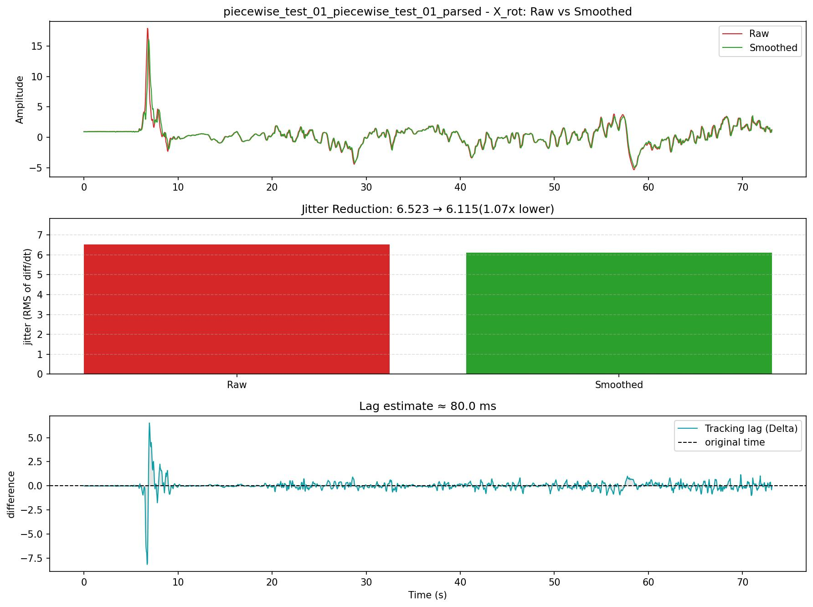 | 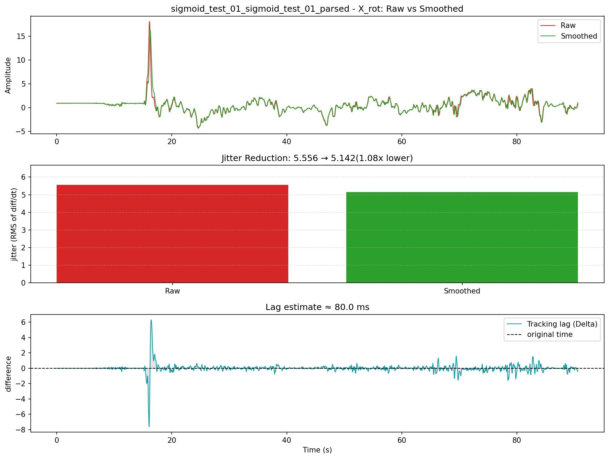 |

**What these plots show**

- These plots are from different shots, each with a different model set at runtime.
- No matter the chosen model or the targeted axis, the validation pipeline provides those insightful plots, making it a robust and reliable validation tool for any runtime session.

---

## 7. Modularity and scalability

This project is structured so that individual components can be replaced or extended without breaking the rest:

- **Data acquisition**
  Any system that outputs `tracking_logs.csv` with the same schema can plug into the pipeline: different trackers, different scenes, or even synthetic motion.

- **Kinematics and features**
  `kinematics.py` centralises time-based derivatives using a causal backward-difference scheme shared by all models. Additional features (e.g. jerk, windowed energy, frequency-domain metrics) can be added here without touching the model code.

- **Models**
  - `linear_sigma_model.py` implements a single, interpretable baseline.
  - `<any_additional_model(s)>_sigma_model.py` file(s) implement alternative mapping strategies based on their sigma breakpoints and speed ranges.
  - Each sigma model reads from `tracking_derivatives.csv` and writes to its own modelled CSV and configuration JSON.
  - `one_euro_filter_model.py` implements a velocity-adaptive filter that does not use sigma or acceleration bounds. It reads from both `tracking_logs.csv` and `tracking_derivatives.csv`, writes `one_euro_modeled.csv` and `one_euro_params.json`, and follows the same three-step service structure (parse → kinematics → model) as the sigma models. New models with fundamentally different operating principles can be added in the same way, each as a self-contained script with its own service and bash runner.

- **Validation**
  - The validation pipeline processes the raw .log files at `data/validation/raw` and creates the .csv files needed for the service.
  - Each runtime session from any chosen model produces 6 validation plots, one for each axis.
  - The generated .csv files at `data/validation/simulate` can be utilised to run offline simulation on any `<model>_smoothing_sim.py` or `one_euro_smoothing_sim.py` script, enabling direct cross-model comparison on the same shot.
  - The same files can be further utilised to provide direct comparison across different environments on the same model.

---

## 8. Summary

To reproduce the core results:

1. Provide or generate raw .log files in `data/raw/` to generate the csv files required by the modelling pipeline.

2. Run the pipeline inside Docker:

   ```bash
   docker compose build
   docker compose run --rm linear      # or piecewise / sigmoid / one_euro
   ```

3. Generate any of the example plots using the CLI commands as shown in §4.

4. Provide or generate raw .log files in `data/validation/raw/` to generate the csv files required by the validation pipeline.

5. Run the validation pipeline inside Docker:

   ```bash
   docker compose build
   docker compose run --rm validation
   ```

The combination of the structured datasets, modular scripts, and Docker-based execution aims to make the system transparent, reproducible, and easy to extend for further scalability when testing with new models or datasets.